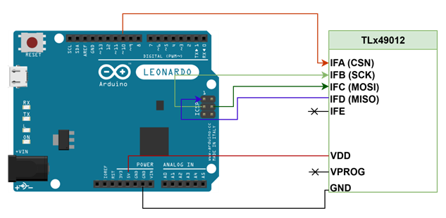

# SPI In-Frame Read and Write Example Code for TLx49012 Angle Sensors

## 1. Introduction
This code example provides a starting point for interfacing the TLx49012 angle sensor with an Arduino&trade; development board using the **SPI** interface. 
Although the example code targets Arduino, the majority of functions are MCU agnostic and can be adapted to fit any target.
>Note: The provided example code is not a qualified solution and is provided "as-is".

### 1.1 Short Description
This example code covers:
-	SPI In-Frame addressing scheme
    -	Read In-Frame
    -	Write In-Frame
    -	Clear status option
-	CRC calculations for MOSI frame
-   CRC calculations for user configuration bitmap registers
-   CRC check disable for USER bitmap
-	MISO frame decoding in Device Status / Data / CRC
-	Angle readout and decoding in degrees
-   Angle base and direction change via register write
-	Unlock procedure
-	Chip soft reset from non-volatile or volatile memory
-	Useful data print to serial monitor

#### 1.1.1 Environment Information
- **Board**: Arduino&trade; Leonardo
- **MCU**: ATmega32u4
- **IDE**: Arduino&trade; IDE

## 2. Getting Started
### 2.1. Hardware Connection

The block diagram below shows the required connections between the TLx49012 angle sensor and the Arduino&trade; Leonardo board. 
Additional components, such as **decoupling capacitors**, are not depicted. Please refer to the device datasheet for additional application information.
>Note: This schematic features a generic SPI interfacing scheme and can be adapted to any MCU.
>
>Note: This schematic depicts the TLx49012 angle sensor being supplied @ 5V, chip is also 3V3 tolerant. 
>Choose supply based on requirements.
<br>



<br>

### 2.2 Project Import and Environment
This example code was developed using the **Arduino&trade; IDE**. Software is required for running the example code. 
For additional information (e.g. installation) please follow the next link:
- [Arduino&trade; IDE](https://www.arduino.cc/en/software/)

Once installed, simply double click the INO file and the project will be imported in the IDE. 
Select the appropriate board and upload sketch after assuring a valid hardware connection.
### 2.3 Initialization
At the beginning of the program, the function `setup()` initializes the fast CRC, SPI and the serial port `@115200` baud rate. 
Additional information is provided in the next subchapter.
### 2.4 Available Functions
This subchapter provides a list of the functions available in this example code.

**void CRCInit(void)**
> Initializes the LUT (Look Up Table) for fast CRC8 SAE J1850. LUT is stored in `uint8_t crcTable[256]`<br> 
> Function is called on setup/initialization

**uint8_t CalcCRC(uint8_t * buf, uint8_t len, uint8_t seed)**
> Calculates the 8-bit fast CRC using the initialized LUT<br>
> `uint8_t * buf` - Pointer to the byte data stream to be protected by CRC<br>
> `uint8_t len` - Length of the data stream<br>
> `uint8_t seed` - CRC seed (`0xFF` for the SPI communication / `0xAA` for configuration bitmap)<br>
> Returns `uint8_t` - Calculated 8-bit CRC

**void SPIInit(void)**
> Initializes: the CS pin to output, SPI peripheral with the default pinout & SPI parameters:
> SPI @1MHz, MSB__First, SPI_MODE1 (CPOL - 0; CPHA - 1)<br>
> **MCU Dependent**<br>

**uint32_t SpiSendAndReceive(uint8_t * data_temp)**
> SPI Backbone. Sends 4 bytes and receives 4 bytes. Prints the MOSI frame on serial<br>
> **MCU Dependent**<br>
> `uint8_t* data_temp` - Pointer to array containing data to be sent via SPI<br>
> Returns `uint32_t` - Received full MISO frame (1 byte Status/ 2 bytes Data/ 1 byte CRC)

**uint32_t SpiReadInFrame(uint8_t addr, bool clearStatus)**
> SPI Read In Frame - Composes and sends the MOSI frame<br>
> `uint8_t addr` - Address to read from (7 bits max)<br>
> `bool clearStatus` - Option to clear device status<br>
> Returns `uint32_t` - 32 bit sensor response (data from addr)

**uint32_t SpiWriteInFrame(uint8_t addr, uint16_t data)**
> SPI Write In Frame - Composes and sends the MOSI frame<br>
> `uint8_t addr` - Address to write to (7 bits max)<br>
> `uint16_t data` - Data to be written<br>
> Returns `uint32_t` - 32 bit sensor response (provides the data from the addressed register before the write action)

**uint8_t CalcUserConfigCRC(uint8_t startAddr, uint8_t stopAddr, bool clearStatus)**
> Calculates the User Configuration block CRC<br>
> `uint8_t startAddr` - Start address of block<br>
> `uint8_t stopAddr` - Stop address of block<br>
> `bool clearStatus` - Option to clear device status<br>
> Returns `uint8_t` - Calculated CRC of the block

**void WriteUserConfigCRC()**
> Writes the CRC for the bitmap User Configuration block

**float GetAngleDeg(uint16_t angleLsb)**
> Converts raw angle in degrees<br>
> `uint16_t angleLsb` - Unsigned 16 bit raw angle
> Returns `float` - float angle in 360 degrees range

### Implementation Example
This subchapter provides an implementation example using the previously described functions.<br>
**Read example**: Reads the predicted angle register, prints the device status, data, CRC and the decoded angle in degrees.<br>
**Write example**: Unlocks device, disables CRC checks for bitmap, writes the angle base and direction registers (prints data before and after operation), calculates and writes the new CRC for the user configuration registers and restarts the sensor from NVM or VM.
<br>
```c
// Bool used to choose SPI angle decoding in case it is read
bool DECODE_ANGLE = true;

void loop()
{
  // Static frame variables
  static uint32_t   responseFrame;
  static uint8_t    responseStatus;
  static uint16_t   responseData;
  static uint8_t    responseCRC;
  // Frame counter
  static uint32_t   frameCount = 0;

  frameCount++;
  Serial.println("");
  Serial.print("**********NEW FRAME********** nr.");
  Serial.println(frameCount);

  // Read any address w/wo Clear Status - MAX ADDR - 127 !
  responseFrame = SpiReadInFrame(ADDR_ANGLE_PRED, true);

  // Decode Frame
  responseStatus  = (responseFrame >> 24) & 0xFF;
  responseData    = (responseFrame >> 8) & 0xFFFF;
  responseCRC     = responseFrame & 0xFF;
  
  // Print data
  Serial.print("MISO Frame: 0x");
  Serial.println(responseFrame, HEX);

  Serial.print("Status: 0x");
  Serial.println(responseStatus, HEX);

  Serial.print("Data: 0x");
  Serial.println(responseData, HEX);

  Serial.print("CRC: 0x");
  Serial.println(responseCRC, HEX);

  // Option to decode angle
  if(DECODE_ANGLE)
  {
    Serial.print("###########ANGLE[deg]: ");
    Serial.println(GetAngleDeg(responseData), 2);
  }


  // #################### Write example ###########################
  static uint32_t temp;

  Serial.println("");
  Serial.println("***WRITE EXAMPLE***");

  // Unlock user registers for write access
  SpiWriteInFrame(UNLOCK_REG, USR_PASS);

  // Disable CRC check for bitmap
  SpiWriteInFrame(STAT_EN_1_REG, CRC_BM_DIS);

  // Write any USER register
  temp = SpiWriteInFrame(USR_CONFIG_7_REG, 0x1001);
  Serial.print("                        Data before write: 0x");
  temp = (temp >> 8) & 0xFFFF; // Display only data
  Serial.println(temp, HEX);

  temp = SpiReadInFrame(USR_CONFIG_7_REG, true);
  Serial.print("                        Data after write: 0x");
  temp = (temp >> 8) & 0xFFFF; // Display only data
  Serial.println(temp, HEX);

  WriteUserConfigCRC(); // Update CRC - Mandatory for restart from VM, volatile data is lost in case of wrong CRC detection

  SpiWriteInFrame(STAT_EN_REG, VAL_SOFT_RESET_NVM_DATA); // Restart from NVM - lose all volatile data
  //SpiWriteInFrame(STAT_EN_REG, VAL_SOFT_RESET_VM_DATA); // Restart from VM - keep all volatile data


  // Readout delay - Can be changed
  delay(1000);
}
```
Console output:
```console
**********NEW FRAME********** nr.58
MOSI Frame: 0x1800FF21
MISO Frame: 0x44D038D8
Status: 0x44
Data: 0xD038
CRC: 0xD8
###########ANGLE[deg]: 292.81

***WRITE EXAMPLE***
MOSI Frame: 0xF1471135
MOSI Frame: 0x97E1893
MOSI Frame: 0x8B100118
                        Data before write: 0x0
MOSI Frame: 0x8A00FFFA
                        Data after write: 0x1001
MOSI Frame: 0x7E00FF74
MOSI Frame: 0x8000FFF5
MOSI Frame: 0x8200FFF6
MOSI Frame: 0x8400FFF3
MOSI Frame: 0x8600FFF0
MOSI Frame: 0x8800FFF9
MOSI Frame: 0x8A00FFFA
MOSI Frame: 0x8C00FFFF
MOSI Frame: 0x8E00FFFC
MOSI Frame: 0x9000FFED
MOSI Frame: 0x9200FFEE
MOSI Frame: 0x9400FFEB
MOSI Frame: 0x9600FFE8
MOSI Frame: 0x9800FFE1
MOSI Frame: 0x9A00FFE2
MOSI Frame: 0x9A00FFE2
MOSI Frame: 0x9BB0572C
                        New CRC: 0x57
MOSI Frame: 0x58E8165
```

