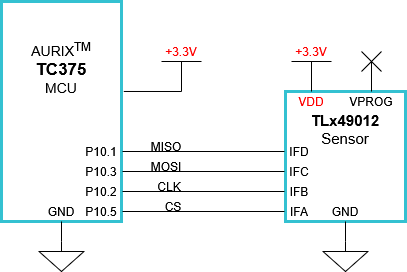
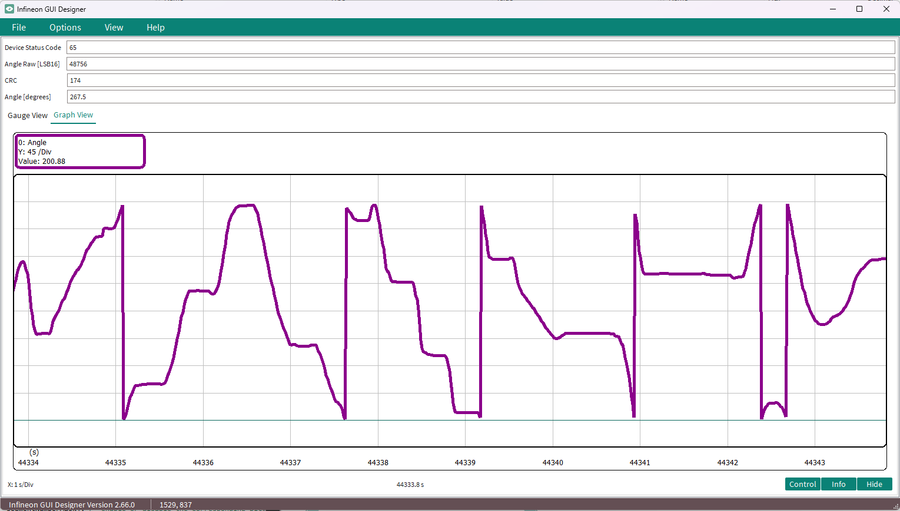
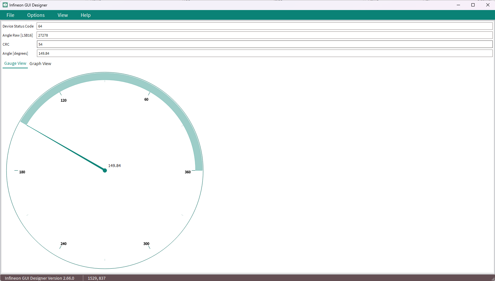

<center>

{width=150}

</center>

# TLx49012_TC375_LK_SPI_Integration_Example

This example code aims to provide a starting point for integrating the TLx49012 magnetic angle sensor with the TC375 AURIX&trade; MCU using SPI communication.

## Device

The device used in this example is AURIX&trade; TC37xTP_A-Step.

## Board

The board used for testing is the AURIX&trade; TC375 lite Kit (KIT_A2G_TC375_LITE).

## Scope of work

The TLx49012 angle data is read via full-duplex SPI communication using the QSPI2 module with DMA transfers. The received 32-bit SPI frame is decoded and processed to extract device status, raw angle data and CRC. The raw angle value is converted to a float angle in degrees and sent to the computer for serial monitoring. Alternatively, a OneEye UI is included in the project for live data visualization.

## Introduction

This integration example has the following features and content:

1. Full-duplex SPI communication with the TLx49012 magnetic angle sensor via QSPI2 module
2. 32-bit SPI frame decoding (Device Status, Angle Data, CRC)
3. Raw angle conversion from uint16 [LSB16] to float [degrees]
4. OneEye UI for live data visualization
5. Serial print for relevant data

>**Note**: For more details about the TLx49012 sensor, please refer to the datasheet.

## Hardware setup

This code example has been developed for the board KIT_A2G_TC375_LITE.

**The AURIX™ lite Kit V2 works with 3.3 V logic levels.
Vcc supply, which is the I/O reference, is set to 3V3.
Ensure the SPI lines are compatible with the configured external voltage to avoid incorrect communication or risk of damaging the MCU port or the TLx49012 sensor.**

<center>

{width=1000}

</center>

## Implementation

### SPI Frame Structure

The TLx49012 responds to each SPI transaction every 500us with a 32-bit frame structured as follows:

```
| Bits    | Field         | Description                          |
|---------|---------------|--------------------------------------|
| [31:24] | Device Status | 8-bit status field (MSB)             |
| [23:8]  | Angle Data    | 16-bit raw angle value (0-65535)     |
| [7:0]   | CRC           | CRC8_SAE_J1850 checksum (LSB)        |
```

The SPI interface is configured as:
- **Mode**: Full-duplex
- **Word length**: 32 bits
- **CPOL**: 0
- **CPHA**: 1

### Initialization

The system initialization is performed in the main function and consists of the following key steps:

**Initialization Sequence:**
- `InitSPI()` - Initializes the QSPI2 module for full-duplex SPI communication with the TLx49012. Configures the DMA channels, chip select, clock polarity/phase, and associated port pins required for sensor communication
- `UART_init()` - Initializes the UART module for serial communication. Configures the baud rate, data format, and associated port pins required for transmission and reception.
- `TLx49012_Init()` - Initializes the CRC fast calculation vector and sends the appropriate commands to the TLx49012 sensor to configure it for SPI operation.

>**Note:** These initialization functions must be called before starting SPI communication with the sensor.

### Main Loop

The main program loop continuously reads the sensor and processes the received data:

**Main Loop Execution:**
- `TLx49012_GetAngleDegrees()` - Initiates the SPI transfer, decodes the 32-bit response frame, and returns the calculated angle as a double value in degrees
- `g_angle` - Stores the resulting angle truncated to two decimal places for monitoring and visualization
- `TLx49012_PrintSerialData()` - Sends the acquired data through the UART channel
- `TIME_wait_us(500)` - Introduces a 500 us delay between consecutive measurements to control the sampling rate

>**Note:** The SPI read is triggered in a loop for demonstration purposes. In a real application, it should be called from any periodic interrupt service routine (ISR).

## Available Functions

The functions implemented in this code example are listed below with a brief description of their purpose.

---

# TLx49012 Functions

### `TLx49012_Init(void)`

> Initializes the TLx49012 magnetic angle sensor for SPI operation by configuring CRC, unlocking registers, and applying user settings. Outputs initialization progress via UART serial prints.
> Returns `void` — No return value

Key points of this function:
- Prints initialization status messages via UART throughout the process
- Populates the CRC8_SAE_J1850 lookup table via `CRCInit()`
- Waits 550 µs for the SPI interface to become active after power-on
- Unlocks the sensor register access by writing the user password (`USR_PASS_DATA`)
- Disables bitmap CRC checks by configuring `STAT_EN_1_REG` register.
- Verifies the sensor is responding and unlocked by reading back `STAT_EN_1_REG` register
- Applies user configuration via `USR_CONFIG_1_REG` register with `USR_CONFIG_1_DATA`
- Performs a soft reset from VM memory to apply the configuration via `STAT_EN_REG` register
- Waits 900 µs for the SPI interface to become active after reset
- Verifies the configuration was applied correctly after reset by reading back `USR_CONFIG_1_REG` register
- Halts execution in an infinite loop with periodic UART error messages if the sensor does not respond or configuration is not applied correctly

---

### `TLx49012_GetAngleLSB(void)`

> Reads the predicted angle register (`ANGLE_PRED_ADDR`) from the TLx49012 sensor and returns the raw 16-bit angle value.
> Returns `uint16` — Raw angle value in LSB (0–65535)

Key points of this function:
- Initiates a SPI read transaction targeting the `ANGLE_PRED_ADDR` register
- Extracts the 16-bit angle data from bits [23:8] of the 32-bit SPI response frame
- Returns the unscaled raw angle value directly without conversion

---

### `TLx49012_GetAngleDegrees(void)`

> Reads the predicted angle register (`ANGLE_PRED_ADDR`) from the TLx49012 sensor, decodes the full 32-bit SPI frame, and converts the raw angle to degrees.
> Returns `double` — Angle value in degrees (0.00 to 359.99)

Key points of this function:
- Initiates a SPI read transaction targeting the `ANGLE_PRED_ADDR` register
- Decodes the 32-bit SPI response frame into its constituent fields
- Updates `g_CRC_raw` with the CRC byte extracted from bits [7:0]
- Updates `g_angle_raw` with the raw 16-bit angle value extracted from bits [23:8]
- Updates `g_status_raw` with the device status byte extracted from bits [31:24]
- Converts the raw angle to degrees using the formula: `(g_angle_raw × 360.0) / 65536`
- Returns the result in a double precision floating-point format

---

### `TLx49012_PrintSerialData(void)`

> Prints the decoded SPI frame data to the serial console via UART, including device status, raw angle, CRC, and calculated angle in degrees.
> Returns `void` — No return value

Key points of this function:
- Formats and transmits a complete data frame summary over UART
- Displays `g_status_raw` as a hexadecimal device status byte (0x00–0xFF)
- Displays `g_angle_raw` as a hexadecimal 16-bit raw angle value (0x0000–0xFFFF)
- Displays `g_CRC_raw` as a hexadecimal CRC byte (0x00–0xFF)
- Displays `angle` as a floating-point value in degrees with two decimal places
- This function sends what values `TLx49012_GetAngleDegrees()` last retrieved from the sensor

---

# TC375 Functions

### `TIME_wait_us(uint32 us)`

> Blocking delay function that waits for a specified number of microseconds.
> `uint32 us` — Time to wait in microseconds
> Returns `void` — No return value

Key points of this function:
- Uses the System Timer Module (STM) for precise timing
- Converts microseconds to STM timer ticks using `IfxStm_getTicksFromMicroseconds()`
- Calls `waitTime()` to perform the actual blocking delay

---

### `TIME_wait_ms(uint32 ms)`

> Blocking delay function that waits for a specified number of milliseconds.
> `uint32 ms` — Time to wait in milliseconds
> Returns `void` — No return value

Key points of this function:
- Uses the System Timer Module (STM) for precise timing
- Converts milliseconds to STM timer ticks using `IfxStm_getTicksFromMilliseconds()`
- Calls `waitTime()` to perform the actual blocking delay

---

### `asclin0_Tx_ISR(void)`

> Interrupt Service Routine for ASCLIN0 transmit operations.
> Returns `void` — No return value

Key points of this function:
- Automatically called when ASCLIN0 TX interrupt is triggered
- Calls `IfxAsclin_Asc_isrTransmit()` to handle the transmission process
- Configured with priority `INTPRIO_ASCLIN0_TX`
- Required for interrupt-driven UART transmission

---

### `UART_init(void)`

> Initializes the UART (ASCLIN0) peripheral for serial communication.
> Returns `void` — No return value

Key points of this function:
- Configures ASCLIN0 module with default settings using `IfxAsclin_Asc_initModuleConfig()`
- Sets baud rate to `SERIAL_BAUDRATE` for serial communication
- Configures TX interrupt priority and assigns to current CPU core
- Sets up TX FIFO buffer (`g_ascTxBuffer`) with size `ASC_TX_BUFFER_SIZE`
- Configures only TX pin in push-pull mode (RX, RTS, CTS pins not used)
- Uses CMOS automotive speed class 1 for pad driver
- Initializes the module with configured parameters

---

### `UART_send_buf(void * data, int16 count)`

> Sends data buffer via UART with blocking wait until transmission is complete.
> `void *data` — Pointer to data buffer to be transmitted
> `int16 count` — Number of bytes to transmit
> Returns `int32` — Transmission result status

Key points of this function:
- Calls `IfxAsclin_Asc_write()` to transmit data via TX pin
- Uses `TIME_INFINITE` timeout for guaranteed transmission
- Blocks until TX FIFO is empty to ensure all data is transmitted
- Returns the transmission result for error checking
- Used by `TLx49012_PrintSerialData()` to send formatted data to console

---

# CRC Function

**Configuration:**
- `CRC_SEED` – CRC seed value set to `0xFF`. This is the initial value used to start the CRC calculation algorithm (standard SAE J1850 initialization)
- `CRC_POLY` – CRC polynomial set to `0x1D` (CRC8_SAE_J1850 standard polynomial)


### `CRCInit(void)`

> Initializes the CRC8_SAE_J1850 lookup table by pre-computing CRC values for all possible byte values (0x00–0xFF).
> Returns `void` — No return value

Key points of this function:
- Iterates through all 256 possible byte values (0x00 to 0xFF)
- For each byte, computes the CRC8 value by processing all 8 bits
- Uses the SAE J1850 polynomial `0x1D` for the CRC calculation
- Each bit iteration: if MSB is set, shifts left and XORs with polynomial; otherwise just shifts left
- Stores the computed CRC value in `crcTable[i]` for fast runtime lookup
- Must be called once during initialization before any calls to `CalcCRC()`
- Populates the 256-entry lookup table used by `CalcCRC()` for O(1) per-byte CRC computation

---

### `CalcCRC(uint8 * buf, uint8 len)`

> Calculates the CRC8_SAE_J1850 checksum for SPI frame validation using a fast lookup table algorithm.
> `uint8 * buf` — Pointer to the data buffer to calculate CRC over
> `uint8 len` — Number of bytes in the buffer
> Returns `uint8` — Calculated 8-bit CRC value (0x00–0xFF)

Key points of this function:
- Uses a pre-computed 256-entry lookup table (`crcTable`) for fast CRC8 calculation
- Initializes CRC with seed value `0xFF` (standard SAE J1850 initialization)
- Iterates through all bytes in the buffer
- Each iteration: XORs current byte with current CRC value and looks up the result in the table
- Performs final bitwise complement (`~_crc`) on the result
- Returns 8-bit CRC for comparison with received CRC byte in the SPI frame

**CRC Lookup Table:**
- `crcTable[256]` contains computed CRC8_SAE_J1850 values. These values are computed during the CRC initialization phase and stored in flash memory for fast access during runtime.
- Provides O(1) lookup time for each byte, making CRC calculation very fast
- Essential for real-time SPI frame validation


---

# SPI Functions

### `InitSPI(void)`

> Initializes the SPI peripheral by configuring the QSPI2 module for full-duplex communication with the TLx49012 sensor.
> Returns `void` — No return value

Key points of this function:
- Calls `initQSPI()` to configure the QSPI2 module, DMA channels, chip select, clock polarity/phase, and port pins
- Serves as the top-level SPI initialization entry point called during system startup
- Must be called before any SPI communication with the TLx49012 sensor

---

### `SpiWriteInFrame(uint8 addr, uint16 data)`

> Constructs a 32-bit SPI write frame with address, data, and CRC, then transmits it to the TLx49012 sensor and returns the response.
> `uint8 addr` — 7-bit register address to write to
> `uint16 data` — 16-bit data value to write to the specified register
> Returns `uint32` — 32-bit SPI response frame from the sensor

Key points of this function:
- Builds a 4-byte transmit frame: `[Address(7bit) | R/W(1bit)][Data MSB][Data LSB][CRC]`
- Sets the R/W bit to `1` to indicate a write operation
- Shifts the 7-bit address into bits [7:1] of the first byte
- Splits the 16-bit data into two bytes (MSB and LSB)
- Calculates CRC8_SAE_J1850 over the first 3 bytes using `CalcCRC()`
- Calls `SpiSendAndReceive()` to perform the full-duplex SPI transaction
- Returns the 32-bit response frame received from the sensor during the transfer

---

### `SpiReadInFrame(uint8 addr, uint8 clearStatus)`

> Constructs a 32-bit SPI read frame with address, optional status clear, and CRC, then transmits it to the TLx49012 sensor and returns the response.
> `uint8 addr` — 7-bit register address to read from
> `uint8 clearStatus` — If non-zero, sets data bytes to `0x00FF` to clear device status bits; if zero, sets data bytes to `0x0000`
> Returns `uint32` — 32-bit SPI response frame from the sensor

Key points of this function:
- Builds a 4-byte transmit frame: `[Address(7bit) | R/W(1bit)][Data MSB][Data LSB][CRC]`
- Sets the R/W bit to `0` to indicate a read operation
- Shifts the 7-bit address into bits [7:1] of the first byte
- Sets the first data byte (MSB) to `0x00` (unused for reads)
- Sets the second data byte (LSB) to `0xFF` if `clearStatus` is non-zero (clears device status bits), or `0x00` otherwise
- Calculates CRC8_SAE_J1850 over the first 3 bytes using `CalcCRC()`
- Calls `SpiSendAndReceive()` to perform the full-duplex SPI transaction
- Returns the 32-bit response frame containing the requested register data

---

### `SpiSendAndReceive(uint8* data_temp)`

> Assembles a 4-byte array into a 32-bit word and performs a full-duplex SPI transaction with the TLx49012 sensor.
> `uint8* data_temp` — Pointer to a 4-byte array containing the SPI frame to transmit
> Returns `uint32` — 32-bit SPI response frame received from the sensor

Key points of this function:
- Combines the 4-byte transmit buffer into a single 32-bit word in big-endian order: `[byte0 << 24 | byte1 << 16 | byte2 << 8 | byte3]`
- Calls `SpiMasterSendAndReceive()` to perform the low-level full-duplex SPI transfer via the QSPI2 module
- Returns the 32-bit response frame received simultaneously from the sensor during the transfer
- Used internally by `SpiWriteInFrame()` and `SpiReadInFrame()` as the common SPI transmission layer

---


## Compiling and programming

Before testing this code example:
- Connect the board to the PC through the USB interface
- Open the AURIX&trade; Development Studio and import the project using **File > Import > AURIX Development Studio Project**
- Build the project using the dedicated Build button  or by right-clicking the project name and selecting **Build Project**
- To flash the device and immediately run the program, click on the dedicated Flash button 

>**Note:** The project is configured for the TC375 lite Kit by default.

## Run and Test

After code compilation and flashing the device, perform the following steps to test the TLx49012 SPI integration:

### Hardware Connection

1. Connect the TLx49012 sensor's SPI lines to the configured MCU pins:

```
| Pin Name | MCU Pin | Sensor Pin |
|----------|---------|------------|
| Supply   | +3.3V   | VDD        |
| Ground   | GND     | GND        |
| CS       | P10.5   | IFA        |
| CLK      | P10.2   | IFB        |
| MOSI     | P10.3   | IFC        |
| MISO     | P10.1   | IFD        |
```


2. Ensure proper power supply to the sensor (3.3 V)
3. Connect a serial terminal (e.g., PuTTY, Tera Term) to the correct communication port:
   - **Baud rate:** 115200
   - **Data bits:** 8
   - **Stop bits:** 1
   - **Parity:** none
   - **New line at:** LF
4. (Optional) Connect an oscilloscope to the SPI lines to monitor communication

### Verification Steps

**Serial Console Monitoring:**
1. Open your serial terminal application
2. Configure the connection with the appropriate COM port and baud rate
3. Run the application
4. Observe the serial output displaying:
   - Device Status byte
   - Raw angle value (uint16, 0-65535)
   - Float angle value (0.00 to 359.99 degrees)
   - CRC byte

**Example Serial Output:**

```
Sensor initialization in progress...
Unlocking sensor...
Disabling CRC checks for bitmaps...
Configuring sensor...
Resetting sensor...
Sensor initializations DONE!

NEW FRAME
Device Status: 0x40
Angle [LSB16]: 0xEA4B
CRC:           0xA3
Angle [deg]:   329.47

NEW FRAME
Device Status: 0x40
Angle [LSB16]: 0xEA49
CRC:           0x99
Angle [deg]:   329.46

NEW FRAME
Device Status: 0x40
Angle [LSB16]: 0xEA47
CRC:           0x3F
Angle [deg]:   329.45

NEW FRAME
Device Status: 0x40
Angle [LSB16]: 0xEA47
CRC:           0x3F
Angle [deg]:   329.45
```


**OneEye UI Visualization:**

This project is delivered with a custom OneEye configuration for live angle data display. The OneEye interface includes:
- **Device Status Code** - Live display of the uint8 device status in DEC (0-255)
- **Raw Angle** - Live display of the uint16 raw angle value in DEC (0-65535)
- **CRC** - Live display of the uint8 CRC value in DEC (0-255)
- **Float Angle** - Live display of the calculated angle in degrees (0.00 to 359.99)
- **Gauge** - Visual gauge representing the current angle position
- **Graph** - Time-history graph of the angle value over time

Click on the dedicated OneEye button  in the IDE to open the interface after flashing the device.

>**Note:** Requires OneEye to be installed on the computer.

<center>

{width=1000}

</center>


<center>

{width=1000}

</center>

**Debugger Verification:**
1. Set breakpoints in the data processing and decoding functions
2. Run the application in debug mode
3. Monitor the following global variables:
   - `g_status_raw` - Decoded device status byte
   - `g_angle_raw` - Raw 16-bit angle value (0-65535)
   - `g_CRC_raw` - Received CRC byte from SPI frame
   - `g_angle` - Calculated double angle in degrees (0.00 to 359.99)
4. Verify that data updates correctly with each SPI transaction

**Oscilloscope Verification (Optional):**
1. Monitor the SPI lines to observe:
   - SPI Mode 1: Clock polarity and phase (CPOL=0, CPHA=1)
   - 32-bit word transfer structure
   - Chip select timing
2. Verify the frame structure matches the expected layout (Status[31:24], Angle[23:8], CRC[7:0])

### CRC Validation

The TLx49012 SPI frame includes a CRC8_SAE_J1850 checksum in the LSB byte. The CRC is calculated over the **Device Status** and **Angle Data** bytes (the first 3 bytes of the 32-bit frame).

If CRC validation is required in the application:
- Calculate CRC8_SAE_J1850 over bytes [31:8] of the received frame
- Compare the result against the received CRC byte [7:0]
- Use `0xFF` as the CRC seed value (standard SAE J1850 initialization)

>**Note:** CRC validation is not performed automatically by this example. The raw CRC byte is made available for the user to implement validation if required by the application.

### Troubleshooting

**No Serial Output:**
- Check UART connection and baud rate settings
- Verify the TX pin configuration
- Confirm the initialization sequence completed successfully

**No SPI Data / All Zeros:**
- Verify sensor power supply (3.3 V)
- Check SPI pin connections (MOSI, MISO, CLK, CS)
- Confirm CPOL=0, CPHA=1 configuration
- Monitor SPI lines with an oscilloscope
- Verify DMA channel configuration

**Incorrect Angle Values:**
- Verify the 32-bit frame is being decoded correctly (Status[31:24], Angle[23:8], CRC[7:0])
- Check that the raw-to-float conversion uses the correct scaling factor (value x 360.0) / 65535.0
- Confirm sensor orientation and magnet placement

**CRC Mismatch:**
- Check signal integrity on SPI lines
- Verify CRC seed value is `0xFF`
- Confirm CRC is calculated over the correct bytes (Status + Angle Data)
- Check for noise or interference on the SPI bus

## References

AURIX&trade; Development Studio is available online:
- <https://www.infineon.com/aurixdevelopmentstudio>
- Use the "Import..." function to get access to more code examples

More code examples can be found on the GIT repository:
- <https://github.com/Infineon/AURIX_code_examples>

For additional trainings, visit our webpage:
- <https://www.infineon.com/aurix-expert-training>

For questions and support, use the AURIX&trade; Forum:
- <https://community.infineon.com/t5/AURIX/bd-p/AURIX>

