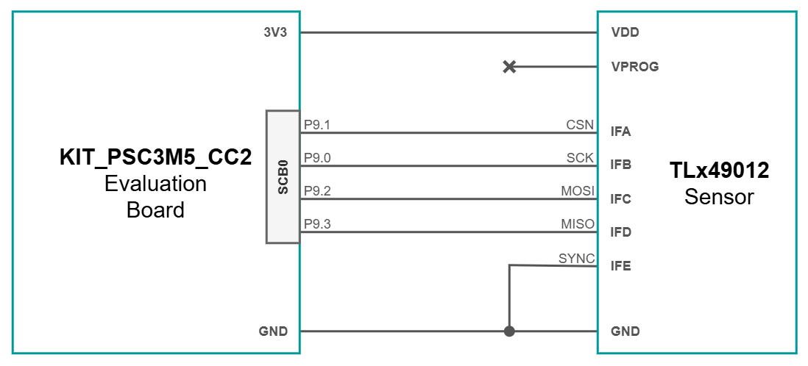
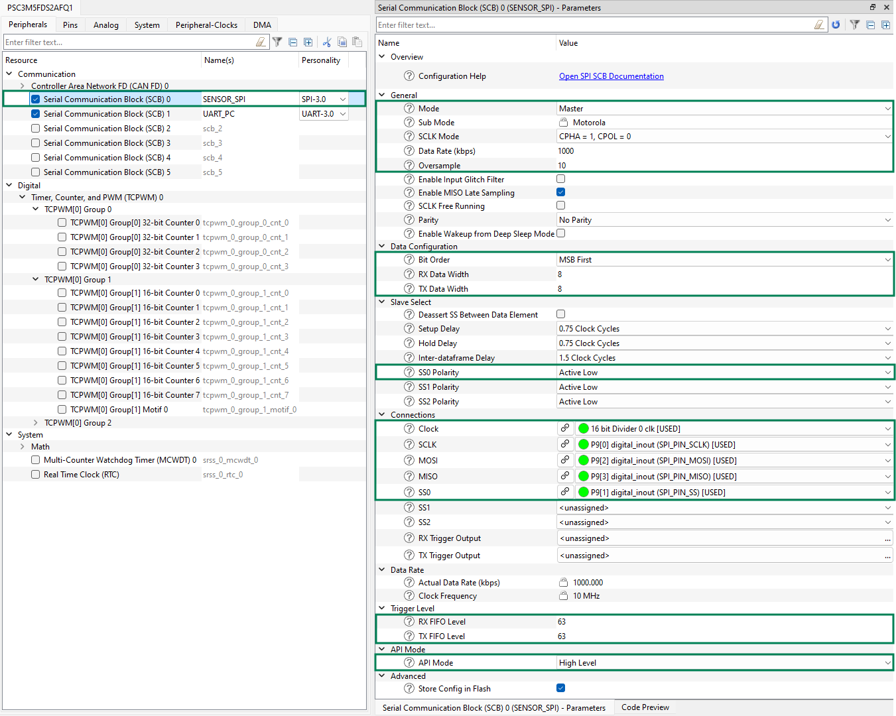
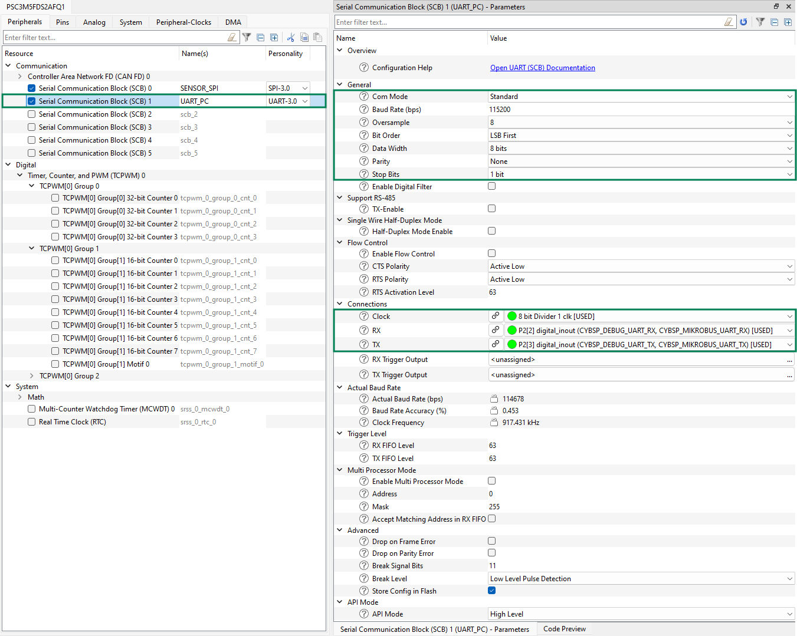

# TLx49012 PSC3M5_CC2 Integration Example

<br>

## 1. Introduction

This code example provides a starting point for interfacing the TLx49012 angle sensor with a PSOC&trade; Control C3 microcontroller, using **SPI**. <br>
The development boards used for this example code are:
- **TLE49012 Satellite Board**;
- **PSOC&trade; Control C3M5 Motor Drive Control Card** (KIT_PSC3M5_CC2), featuring the **PSC3M5FDS2AFQ1** MCU; 
    - [Evaluation Board Infineon website](https://www.infineon.com/evaluation-board/KIT-PSC3M5-CC2)

>Note: The provided example is not a qualified solution and is provided "as-is".

### 1.1. Short Description

This example code performs continuous readouts of the TLx49012 angle sensor registers via SPI, at a frequency of ~20Hz. 
SPI In-Frame addressing scheme is used and exemplified.<br>
For easier interpretation and visualization, the following data is transmitted to the serial port:
- Register angle value, in LSB;
- Calculated angle value, in degrees;

Peripheral configuration is detailed in **Section 2.3**.

<br>

## 2. Getting Started

### 2.1. Hardware Connections

The block diagram below shows the required connections between the TLx49012 angle sensor and the KIT_PSC3M5_CC2 board. 
Additional components, such as **decoupling capacitors**, are not depicted. **Please refer to the TLx49012 Data Sheet for more details!** <br>

<br>



<br>

### 2.2. Project Importing in ModusToolbox&trade; 

This example code was developed using the ModusToolbox&trade; Eclipse IDE, version 2025.4. For more details about the software, check the following links:
- [ModusToolbox&trade; tools package installation guide](https://www.infineon.com/assets/row/public/documents/30/68/infineon-modustoolbox-tools-package-user-guide-gettingstarted-en.pdf) for information about installing and configuring the tools package;
- [Eclipse IDE for ModusToolbox&trade; user guide](https://www.infineon.com/assets/row/public/documents/30/44/infineon-modustoolbox-eclipse-ide-user-guide-usermanual-en.pdf) (locally available at *{ModusToolbox&trade; install directory}/docs_{version}/mt_ide_user_guide.pdf*).

Once installed, the example code project can be imported onto your machine:
1. Create a new folder that will act as your ModusToolbox&trade; workspace;
1. Inside the created folder, right click, Git Bash Here, clone the code example repository;
1. Open ModusToolbox&trade; Eclipse IDE;
1. From the top ribbon, go to **File -> Switch Workspace -> Other... -> Browse...**, and find your workspace folder;
1. From the **Quick Panel** or **File -> Import... -> ModusToolbox&trade;**, select **Import Existing Application In-Place**;
1. Select the copied repository folder and wait for the software to finish importing;
1. Make sure **Project Explorer** includes both **mtb_shared** and the copied repository;
1. If the project does not build, open a **Terminal** tab inside the IDE and run the command `make getlibs`.

<br>

### 2.3. Peripheral Configuration

This chapter represents a rundown of the configuration done in the **Device Configurator** for the peripherals used in the example code, and can be used as a reference or for configuring a new project:
- **SCB0**, for SPI communication with the sensor;
- **SCB1**, for UART communication with the PC.

<br>

<details><summary><b>SCB0</b></summary>

1. Select the **Peripherals** tab of the **Device Configurator**;
1. Select and enable **Serial Communication Block (SCB) 0** (renaming optional);
1. Set the peripheral personality to **SPI-3.0**;
1. Under **General**:
    - **Mode**: Master (default setting is Slave); 
    - **SCLK Mode**: CPHA = 1, CPOL = 0 (as specified in the sensor datasheet);
    - **Data Rate (kbps)**: 1000 (set 1MHz SCLK frequency);
    - **Oversample**: 10 (for easy clock frequency calculus);
1. Under **Data Configuration**:
    - **Bit Order**: MSB First;
    - **RX Data Width**: 8;
    - **TX Data Width**: 8;
1. Under **Slave Select**:
    - **SS0 Polarity**: Active Low;
1. Under **Connections**:
    - **Clock**: 16 bit Divider 0 clk;
    - **SCLK**: P9[0] digital_inout (SPI_PIN_SCLK);
    - **MOSI**: P9[2] digital_inout (SPI_PIN_MOSI);
    - **MISO**: P9[3] digital_inout (SPI_PIN_MISO);
    - **SS0**: P9[1] digital_inout (SPI_PIN_SS);
1. Under **Trigger Level**:
    - **RX FIFO Level**: 63 (high value so it will never trigger, not essential for this implementation);
    - **TX FIFO Level**: 63 (high value so it will never trigger, not essential for this implementation);
1. Under **API Mode**:
    - **API Mode**: High Level (uses a transfer interrupt, will be configured separately);



10. Select the **Pins** tab of the **Device Configurator**;
10. Under **Port 9**, make sure that the pins have the appropriate **Drive Mode**:
    - **P9[0]**: Strong Drive, Input buffer off;
    - **P9[1]**: Strong Drive, Input buffer off;
    - **P9[2]**: Strong Drive, Input buffer off;
    - **P9[3]**: Digital High-Z, Input buffer on.
10. Select the **Peripheral-Clocks** tab of the Device Configurator;
10. Select the **16 bit Divider 0** clock (should already be enabled);
10. Set the **Divider** field so that the following relation is true:
    - **Data Rate (kbps) * Oversample = Source Clock Frequency / Divider**
    - In this case, the desired **Data Rate** is 1000kbps (1MHz SPI SCLK frequency);
    - **Oversample** is set to 10;
    - **16 bit Divider 0** Source Clock Frequency is 100MHz;
    - Plugging the terms into the equation results in a **Divider** equal to 10.
</details>

<br>

<details><summary><b>SCB1</b></summary>

1. Select the **Peripherals** tab of the **Device Configurator**;
1. Select and enable **Serial Communication Block (SCB) 1** (renaming optional);
1. Set the peripheral personality to **UART-3.0**;
1. Under **General**:
    - **Baud Rate (bps)**: 115200 baudrate 
    - **Data Width**: 8 bits;
    - **Parity**: None 
    - **Stop Bits**: 1 bit;
1. Under **Connections**:
    - **Clock**: 8 bit Divider 1 clk;
    - **RX**: P2[2];
    - **TX**: P2[3];



</details>

<br>

### 2.4. Firmware

This chapter provides insight into the firmware structure and program flow.

<br>

#### 2.4.1. Library Organization

Inside the project, the folder `src` houses all the functionalities of this example code:
- `MCU` folder contains all the microcontroller-specific initialization and peripheral functions:
    - `UART` folder contains the UART HAL initialization and serial port data formatting/transmission functions;
    - `SPI` folder contain the SPI initialization sequence and the low-level SPI data transfer function;
- `Sensor` folder contains TLx49012-specific information:
    - `TLx49012.c/h` contain definitions particular to the sensor, as well as the initialization sequence (soft-fusing, disabling CRC checks etc.);
    - `Interface` folder contains the high-level SPI in-frame data transfer functions, complete with 32-bit command generation and CRC.

<br>

#### 2.4.2. Initialization

At the beginning of the program, the function 'cybsp_init()' initializes the peripherals with the settings applied in **Device Configurator**, particularly focusing on hardware connections. This function is present by default upon creating a new project using the ModusToolbox&trade; toolchain and the official Board Support Packages (BSP's).

For further setup, the function `PSC3M5_MCU_Init()` handles firmware aspects of MCU initialization and encapsulates the following:
- `PSC3M5_UART_Init()`: Initializes the UART Hardware Abstraction Layer (HAL), so information can be sent to the serial port using the `printf()` function from `stdio.h`;
- `PSC3M5_SPI_Init()`: Configures the SPI interrupt at the end of a data transfer and enables the SCB0 channel;

After these operations, global interrupts are enabled with the `__enable_irq()` function.

<br>

#### 2.4.3. Available Functions

This chapter provides a list of the functions available in this example code.

**void PSC3M5_MCU_Init(void)**
> This function fully initializes and starts the peripherals of the PSOC&trade; Control C3M microcontroller, as described in Section 2.4.1. <br>
> Call at the beginning of the program.

<br>

**void TLx49012_Init(void)**
> This function initializes the sensor by sending SPI commands. <br>
> The CRC LUT is populated with values, for faster computation when CRC calculus is needed. <br>
> A 550�s delay is applied to ensure the SPI bus is active, assuming the sensor has just been powered on. <br>
> The first SPI command unlocks the internal registers, so that new data can be written. <br>
> Next, the Bitmap CRC checks are disabled by writing to the `STAT_EN_1` register. <br>
> A read-back verification is performed � if the sensor does not respond correctly, execution is halted with an assertion error. <br>
> The sensor is then soft-configured by writing to the `USR_CONFIG_1` register. <br>
> Finally, the sensor is reset from VM memory using the `STAT_EN` register, so register contents are maintained. A 900�s delay is applied to wait for SPI to become active again. <br>
> A second read-back verification checks that the configuration was correctly applied after reset � if not, execution is halted. <br>
> Sensor is ready to receive further commands upon successful completion.

<br>

**uint32_t TLx49012_SPI_WriteInFrame(uint8_t addr, uint16_t data)**
> This function represents the high-level SPI write-in-frame sequence, as described in the sensor datasheet. <br>
> A 32-bit write command is issued to the sensor, composed of the address, WRITE bit, 16-bit data (LSB-first) and calculated CRC. <br>
> Sensor response is received in the same SPI transfer frame. <br>
> `uint8_t addr` - Register address to which data is written. <br>
> `uint16_t data` - Data to be written to sensor register. <br>
> Returns `uint32_t` sensor response.

<br>

**uint32_t TLx49012_SPI_ReadInFrame(uint8_t addr, bool clearStatus)**
> This function represents the high-level SPI read-in-frame sequence, as described in the sensor datasheet. <br>
> A 32-bit read command is issued to the sensor, composed of the address, READ bit, 0x00 byte, device status clear byte, and calculated CRC. <br>
> If the device status byte is all 1's (0xFF), the device status is cleared.
> Sensor response is received in the same SPI transfer frame. <br>
> `uint8_t addr` - Register address from which data is read. <br>
> `bool clearStatus` - Signals whether device status is cleared or not upon command completion. <br>
> Returns `uint32_t` sensor response.

<br>

**uint16_t TLx49012_GetAngleLSB(void)**
> This function reads the content of the register at address 15. <br>
> From the 32-bit sensor response, the status and CRC bytes are ignored. <br>
> Returns `uint16_t` angle value in LSB.

<br>

**void PSC3M5_UART_SendAngleInfo(uint16_t angle)**
> This function displays on the serial port the register angle value [LSB] and the calculated angle value [degrees]. <br>
> `uint16_t angle` - angle value in LSB to be converted to degrees, both values sent to serial port.

<br>

### 2.5. Implementation Example

This section provides the code for ~20Hz continuous readout of the TLx49012 angle sensor on the PSOC&trade; Control C3M5 Motor Drive Control Card. <br>
Angle information (LSB and degrees) can be visualized using any serial port monitor, like hterm or Tera Term.

<br>

```c

#include "cy_scb_common.h"
#include "cy_syslib.h"
#include "cycfg_peripherals.h"
#include "mtb_hal.h"
#include "cybsp.h"

#include "src/MCU/MCU.h"
#include "src/Sensor/TLx49012.h"


/*******************************************************************************
* Global variables
*******************************************************************************/
uint16_t angle_LSB;		// Angle value received via SPI.
    

/*******************************************************************************
* Function Name: main
********************************************************************************
* Summary:
* This function provides continuous readout of the TLx49012 angle sensor.
* Peripherals are configured using the BSP-proprietary function, cybsp_init().
* Interrupt configuration for SPI is done in the PSC3M5_MCU_Init() function.
*
* Parameters:
*  void
*
* Return:
*  int
*
*******************************************************************************/
int main(void)
{
    cy_rslt_t result;

    // Initialize the device and board peripherals
    result = cybsp_init();

    // Board init failed. Stop program execution
    if (result != CY_RSLT_SUCCESS)
    {
        CY_ASSERT(0);
    }

	// Fully initialize peripherals, with SPI interrupt and UART HAL
	PSC3M5_MCU_Init();

	// Initialize CRC LUT and soft-fuse the sensor
	TLx49012_Init();

    // Enable global interrupts
    __enable_irq();
    
    for (;;)
    {	
		// Send SPI read command and get LSB angle value
		angle_LSB = TLx49012_GetAngleLSB();
		
		// Print to serial port the angle in both LSB and degrees
		PSC3M5_UART_SendAngleInfo(angle_LSB);
		
		// ~20Hz readout
		Cy_SysLib_Delay(50);
    }
}
```
Console output example:
```console
Sensor initialization in progress...
Unlocking sensor...
Disabling CRC checks for bitmaps...
Configuring sensor...
Reseting sensor...
Sensor initializations DONE!
ANGLE [LSB]: 0x2593 | ANGLE [deg]: 52.840
ANGLE [LSB]: 0x2593 | ANGLE [deg]: 52.840
ANGLE [LSB]: 0x2593 | ANGLE [deg]: 52.840
ANGLE [LSB]: 0x2593 | ANGLE [deg]: 52.840
ANGLE [LSB]: 0x2593 | ANGLE [deg]: 52.840
ANGLE [LSB]: 0x2593 | ANGLE [deg]: 52.840
ANGLE [LSB]: 0x2593 | ANGLE [deg]: 52.840
ANGLE [LSB]: 0x2593 | ANGLE [deg]: 52.840
```