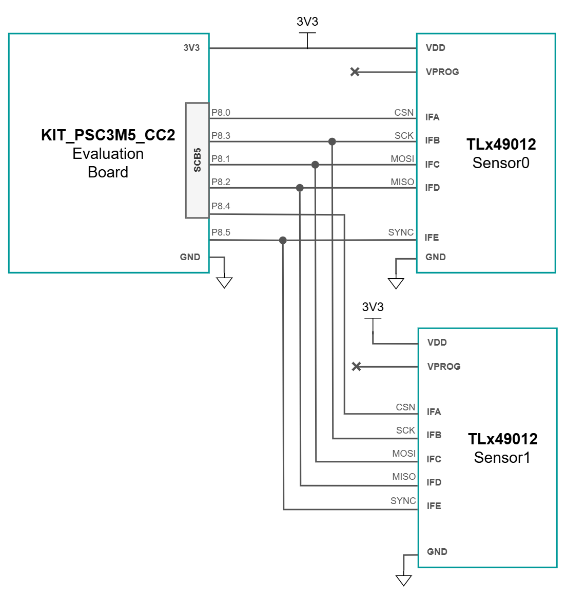
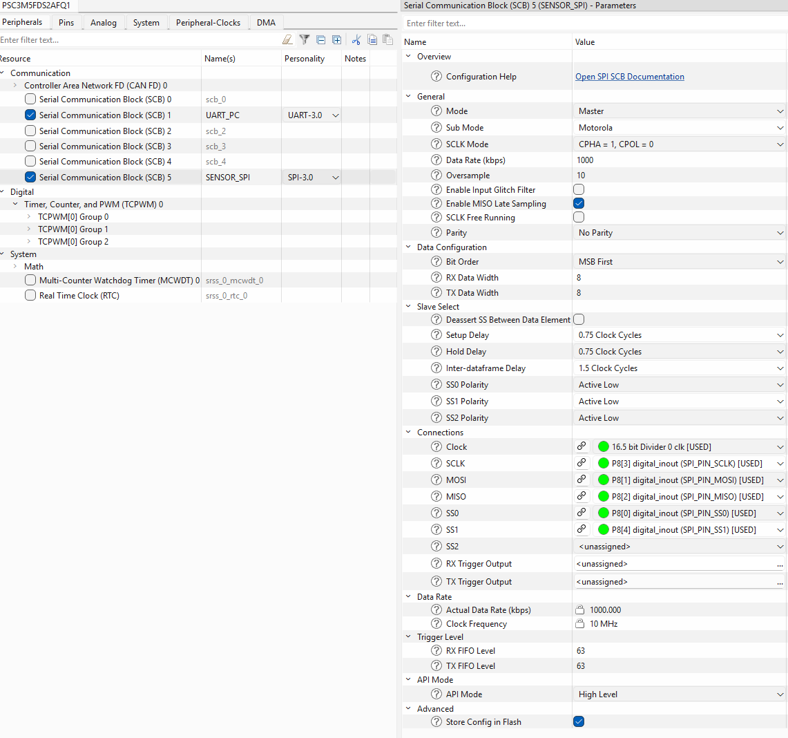
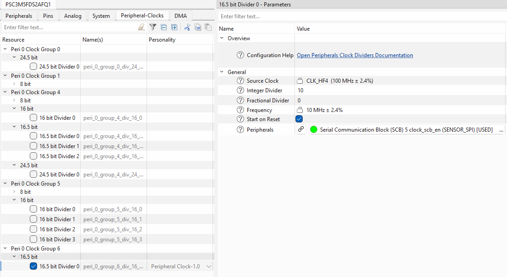
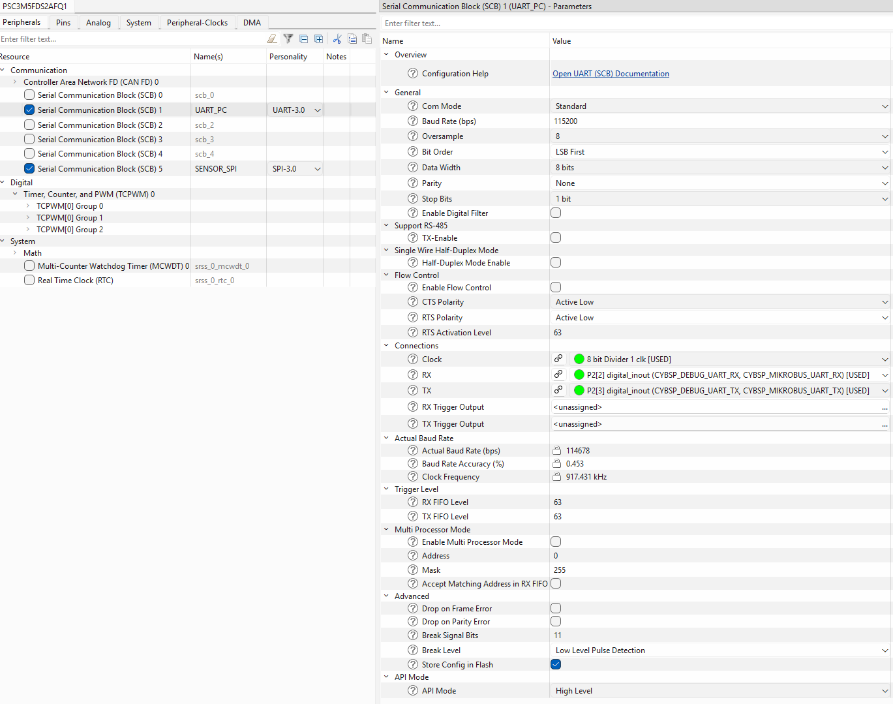
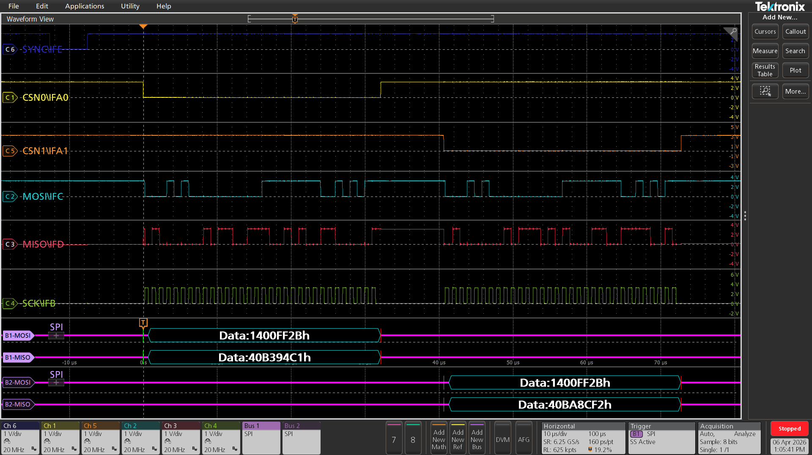

# TLx49012 PSC3M5_CC2 SPI 2-Sensor Sync Integration Example

<br>

## 1. Introduction

This code example provides a starting point for interfacing two TLx49012 angle sensors with a PSOC&trade; Control C3 microcontroller, using **SPI with interrupt-driven transfers**. <br>
The development boards used for this example code are:
- **TLE49012 Satellite Board** (x2);
- **PSOC&trade; Control C3M5 Motor Drive Control Card** (KIT_PSC3M5_CC2), featuring the **PSC3M5FDS2AFQ1** MCU;
    - [Evaluation Board Infineon website](https://www.infineon.com/evaluation-board/KIT-PSC3M5-CC2)

>Note: The provided example is not a qualified solution and is provided "as-is".

### 1.1. Short Description

This example code performs continuous **synchronized** readouts of two TLx49012 angle sensors via SPI using interrupt-driven transfers, at a frequency of ~20Hz. <br>
SPI In-Frame addressing scheme is used and exemplified. A dedicated **SYNC pin** is used to trigger simultaneous angle capture on both sensors.<br>
For easier interpretation and visualization, the following data is transmitted to the serial port:
- Synchronized register angle value, in LSB;
- Calculated angle value, in degrees;

Peripheral configuration is detailed in **Section 2.3**.

<br>

## 2. Getting Started

### 2.1. Hardware Connections

The block diagram below shows the required connections between the two TLx49012 angle sensors and the KIT_PSC3M5_CC2 board.
Additional components, such as **decoupling capacitors**, are not depicted. **Please refer to the TLx49012 Data Sheet for more details!** <br>

<br>



<br>

### 2.2. Project Importing in ModusToolbox&trade;

This example code was developed using the ModusToolbox&trade; Eclipse IDE, version 2025.4. For more details about the software, check the following links:
- [ModusToolbox&trade; tools package installation guide](https://www.infineon.com/assets/row/public/documents/30/68/infineon-modustoolbox-tools-package-user-guide-gettingstarted-en.pdf) for information about installing and configuring the tools package;
- [Eclipse IDE for ModusToolbox&trade; user guide](https://www.infineon.com/assets/row/public/documents/30/44/infineon-modustoolbox-eclipse-ide-user-guide-usermanual-en.pdf) (locally available at *{ModusToolbox&trade; install directory}/docs_{version}/mt_ide_user_guide.pdf*).

Once installed, the example code project can be imported onto your machine:
1. Create a new folder that will act as your ModusToolbox&trade; workspace;
1. Inside the created folder, right click, Git Bash Here, clone the code example repository;
1. Open ModusToolbox&trade; Eclipse IDE;
1. From the top ribbon, go to **File -> Switch Workspace -> Other... -> Browse...**, and find your workspace folder;
1. From the **Quick Panel** or **File -> Import... -> ModusToolbox&trade;**, select **Import Existing Application In-Place**;
1. Select the copied repository folder and wait for the software to finish importing;
1. Make sure **Project Explorer** includes both **mtb_shared** and the copied repository;
1. If the project does not build, open a **Terminal** tab inside the IDE and run the command `make getlibs`.

<br>

### 2.3. Peripheral Configuration

This chapter represents a rundown of the configuration done in the **Device Configurator** for the peripherals used in the example code, and can be used as a reference or for configuring a new project:
- **SCB5**, for SPI communication with the sensors (two slave selects, interrupt-driven);
- **SCB1**, for UART communication with the PC;
- **SYNC pin**, for triggering synchronized angle capture on both sensors.

<br>

<details><summary><b>SCB5</b></summary>

1. Select the **Peripherals** tab of the **Device Configurator**;
1. Select and enable **Serial Communication Block (SCB) 5** (renaming optional);
1. Set the peripheral personality to **SPI-3.0**;
1. Under **General**:
    - **Mode**: Master (default setting is Slave);
    - **SCLK Mode**: CPHA = 1, CPOL = 0 (as specified in the sensor datasheet);
    - **Data Rate (kbps)**: 1000 (set 1MHz SCLK frequency);
    - **Oversample**: 10 (for easy clock frequency calculus);
1. Under **Data Configuration**:
    - **Bit Order**: MSB First;
    - **RX Data Width**: 8;
    - **TX Data Width**: 8;
1. Under **Slave Select**:
    - **SS0 Polarity**: Active Low;
    - **SS1 Polarity**: Active Low;
1. Under **Connections**:
    - **Clock**: 16.5 bit Divider 0 clk;
    - **SS0**: P8[0] digital_inout (SPI_PIN_SS0) — Sensor 0;
    - **MOSI**: P8[1] digital_inout (SPI_PIN_MOSI);
    - **MISO**: P8[2] digital_inout (SPI_PIN_MISO);
    - **SCLK**: P8[3] digital_inout (SPI_PIN_SCLK);
    - **SS1**: P8[4] digital_inout (SPI_PIN_SS1) — Sensor 1;
1. Under **API Mode**:
    - **API Mode**: High Level;



9. Select the **Pins** tab of the **Device Configurator**;
9. Under **Port 8**, make sure that the pins have the appropriate **Drive Mode**:
    - **P8[0]**: Strong Drive, Input buffer off (SPI_PIN_SS0);
    - **P8[1]**: Strong Drive, Input buffer off (SPI_PIN_MOSI);
    - **P8[2]**: Digital High-Z, Input buffer on (SPI_PIN_MISO);
    - **P8[3]**: Strong Drive, Input buffer off (SPI_PIN_SCLK);
    - **P8[4]**: Strong Drive, Input buffer off (SPI_PIN_SS1).
9. Select the **Peripheral-Clocks** tab of the Device Configurator;
9. Select the **16.5 bit Divider 0** clock (should already be enabled);
9. Set the **Divider** field so that the following relation is true:
    - **Data Rate (kbps) * Oversample = Source Clock Frequency / Divider**
    - In this case, the desired **Data Rate** is 1000kbps (1MHz SPI SCLK frequency);
    - **Oversample** is set to 10;
    - **16.5 bit Divider 0** Source Clock Frequency is 100MHz;
    - Plugging the terms into the equation results in a **Divider** equal to 10.



</details>

<br>

<details><summary><b>SCB1</b></summary>

1. Select the **Peripherals** tab of the **Device Configurator**;
1. Select and enable **Serial Communication Block (SCB) 1** (renaming optional);
1. Set the peripheral personality to **UART-3.0**;
1. Under **General**:
    - **Baud Rate (bps)**: 115200 baudrate
    - **Data Width**: 8 bits;
    - **Parity**: None
    - **Stop Bits**: 1 bit;
1. Under **Connections**:
    - **Clock**: 8 bit Divider 1 clk;
    - **RX**: P2[2];
    - **TX**: P2[3];



</details>

<br>

<details><summary><b>Sync Pin</b></summary>

1. Select the **Pins** tab of the **Device Configurator**;
1. Under **Port 8**, select pin **P8[5]** to be configured as SYNC;
1. Set the pin's **Drive Mode** to **Strong Drive, Input buffer off**;
1. Set the pin's **Initial Drive State** to **High**;
1. Assign the pin alias **SYNC_PIN** so it is accessible via `SYNC_PIN_PORT` and `SYNC_PIN_NUM` in firmware.

</details>

<br>

### 2.4. Firmware

This chapter provides insight into the firmware structure and program flow.

<br>

#### 2.4.1. Library Organization

Inside the project, the folder `src` houses all the functionalities of this example code:
- `MCU` folder contains all the microcontroller-specific initialization and peripheral functions:
    - `UART` folder contains the UART HAL initialization and serial port data formatting/transmission functions;
    - `SPI` folder contains the SPI initialization sequence, interrupt service routine, and the blocking SPI data transfer function;
- `Sensor` folder contains TLx49012-specific information:
    - `TLx49012.c/h` contain definitions particular to the sensor, data structures for the sync angle register, as well as the initialization sequence (soft-fusing, disabling CRC checks, sync register clearing etc.);
    - `Interface` folder contains the high-level SPI in-frame data transfer functions, complete with 32-bit command generation and CRC8 SAE J1850 calculation.

<br>

#### 2.4.2. Initialization

At the beginning of the program, the function `cybsp_init()` initializes the peripherals with the settings applied in **Device Configurator**, particularly focusing on hardware connections. This function is present by default upon creating a new project using the ModusToolbox&trade; toolchain and the official Board Support Packages (BSPs).

For further setup, the function `PSC3M5_MCU_Init()` handles firmware aspects of MCU initialization and encapsulates the following:
- `PSC3M5_SPI_Init()`: Configures and enables the SCB5 SPI block, then registers and enables the **SPI interrupt** (`PSC3M5_SPI_Interrupt`) used for interrupt-driven transfers via `Cy_SCB_SPI_Transfer()`;
- `PSC3M5_UART_Init()`: Initializes the UART Hardware Abstraction Layer (HAL), so information can be sent to the serial port using the `printf()` function from `stdio.h`;

After these operations, global interrupts are enabled with the `__enable_irq()` function, followed by a 100ms stabilization delay before sensor initialization begins.

<br>

#### 2.4.3. Available Functions

This chapter provides a list of the functions available in this example code.

**void PSC3M5_MCU_Init(void)**
> This function fully initializes and starts the peripherals of the PSOC&trade; Control C3M microcontroller, as described in Section 2.4.2. <br>
> Call at the beginning of the program.

<br>

**void TLx49012_Init(void)**
> This function initializes **both sensors** by sending SPI commands sequentially to each. <br>
> The CRC LUT is populated with values via `CRC_Init()`, for faster computation when CRC calculus is needed. <br>
> A 550µs delay is applied to ensure the SPI bus is active, assuming the sensors have just been powered on. <br>
> The first SPI commands unlock the internal registers of both sensors, so that new data can be written. <br>
> Next, the Bitmap CRC checks are disabled by writing to the `STAT_EN_1` register on both sensors. <br>
> A read-back verification is performed on each sensor — if a sensor does not respond correctly, execution is halted with an assertion error. <br>
> Both sensors are then soft-configured by writing to the `USR_CONFIG_1` register. <br>
> Both sensors are reset from VM memory using the `STAT_EN` register, so register contents are maintained. A 550µs delay is applied to wait for SPI to become active again. <br>
> A second read-back verification checks that the configuration was correctly applied after reset on each sensor — if not, execution is halted. <br>
> The `ANGLE_SYNC` registers of both sensors are cleared via a read operation. <br>
> Both sensors are ready to receive further commands upon successful completion.

<br>

**uint32_t TLx49012_SPI_WriteInFrame(uint8_t addr, uint16_t data, uint8_t slaveSelect)**
> This function represents the high-level SPI write-in-frame sequence, as described in the sensor datasheet. <br>
> A 32-bit write command is assembled: 7-bit address + WRITE bit (byte 0), 16-bit data MSB-first (bytes 1–2), and CRC8 SAE J1850 (byte 3). <br>
> The command is transferred via `Cy_SCB_SPI_Transfer()` and the function blocks until the transfer is complete. The sensor response is received in the same SPI frame. <br>
> `uint8_t addr` - Register address to which data is written. <br>
> `uint16_t data` - Data to be written to the sensor register. <br>
> `uint8_t slaveSelect` - SPI slave select line (`SPI_SLAVE0` or `SPI_SLAVE1`). <br>
> Returns `uint32_t` sensor response.

<br>

**uint32_t TLx49012_SPI_ReadInFrame(uint8_t addr, bool clearStatus, uint8_t slaveSelect)**
> This function represents the high-level SPI read-in-frame sequence, as described in the sensor datasheet. <br>
> A 32-bit read command is assembled: 7-bit address + READ bit (byte 0), 0x00 unused byte (byte 1), device status clear byte (byte 2), and CRC8 SAE J1850 (byte 3). <br>
> If `clearStatus` is `true`, byte 2 is set to `0xFF` to clear the device status; otherwise it is `0x00`. <br>
> The command is transferred via `Cy_SCB_SPI_Transfer()` and the function blocks until the transfer is complete. The sensor response is received in the same SPI frame. <br>
> `uint8_t addr` - Register address from which data is read. <br>
> `bool clearStatus` - Signals whether device status is cleared or not upon command completion. <br>
> `uint8_t slaveSelect` - SPI slave select line (`SPI_SLAVE0` or `SPI_SLAVE1`). <br>
> Returns `uint32_t` sensor response.

<br>

**uint16_t TLx49012_GetAngleLSB(uint8_t slaveSelect)**
> This function reads the content of the predicted angle register (`ANGLE_PRED_ADDR`, address `0x0C`) of the selected sensor. <br>
> From the 32-bit sensor response, bits [23:8] are extracted, discarding the status and CRC bytes. <br>
> `uint8_t slaveSelect` - SPI slave select line (`SPI_SLAVE0` or `SPI_SLAVE1`). <br>
> Returns `uint16_t` angle value in LSB.

<br>

**AngleSyncRegister TLx49012_GetAngleSyncRegister(uint8_t slaveSelect)**
> This function reads the content of the angle sync register (`ANGLE_SYNC_ADDR`, address `0x0A`) of the selected sensor. <br>
> The 32-bit sensor response bits [23:8] are parsed into an `AngleSyncRegister` union, providing bitfield access to `readStatus` (1 bit), `triggerStatus` (1 bit), and `AngleSync` (14 bits). <br>
> A `readStatus` of `0` indicates fresh/valid data captured at the last sync trigger. <br>
> `uint8_t slaveSelect` - SPI slave select line (`SPI_SLAVE0` or `SPI_SLAVE1`). <br>
> Returns `AngleSyncRegister` sync register value.

<br>

**void TLx49012_TriggerSyncPin(void)**
> This function generates a falling-edge pulse on the configured SYNC GPIO pin. <br>
> The pin is driven low, held for 5µs, then driven high again. <br>
> This triggers a simultaneous angle capture on both sensors.

<br>

**void PSC3M5_UART_SendAngleInfo(uint16_t angle, uint8_t slave)**
> This function displays on the serial port the register angle value [LSB] and the calculated angle value [degrees] for the specified sensor. <br>
> Angle in degrees is calculated as: `angle * 360.0 / 65535` (16-bit full-scale). <br>
> `uint16_t angle` - Angle value in LSB to be converted to degrees. <br>
> `uint8_t slave` - Sensor index (`SPI_SLAVE0` or `SPI_SLAVE1`) printed alongside the values.

<br>

**void PSC3M5_UART_SendSyncAngleInfo(uint16_t angle, uint8_t slave)**
> This function displays on the serial port the synchronized angle register value [LSB] and the calculated angle value [degrees] for the specified sensor. <br>
> Angle in degrees is calculated as: `angle * 360.0 / 16384` (14-bit full-scale, matching the `AngleSync` bitfield width). <br>
> `uint16_t angle` - 14-bit synchronized angle value in LSB to be converted to degrees. <br>
> `uint8_t slave` - Sensor index (`SPI_SLAVE0` or `SPI_SLAVE1`) printed alongside the values.

<br>

### 2.5. Implementation Example

This section provides the code for ~20Hz continuous synchronized readout of two TLx49012 angle sensors on the PSOC&trade; Control C3M5 Motor Drive Control Card. <br>
Angle information (LSB and degrees) can be visualized using any serial port monitor, like hterm or Tera Term.

<br>

```c
#include "cy_scb_common.h"
#include "cy_syslib.h"
#include "cycfg_peripherals.h"
#include "mtb_hal.h"
#include "cybsp.h"

#include "src/MCU/MCU.h"
#include "src/Sensor/TLx49012.h"
#include <stdio.h>


/*******************************************************************************
* Global variables
*******************************************************************************/
AngleSyncRegister g_angleSyncRegister_sensor0; // Register value
AngleSyncRegister g_angleSyncRegister_sensor1; // Register value


int main(void)
{
    cy_rslt_t result;

    // Initialize the device and board peripherals
    result = cybsp_init();

    // Board init failed. Stop program execution
    if (result != CY_RSLT_SUCCESS)
    {
        CY_ASSERT(0);
    }

	// Fully initialize peripherals, with SPI interrupt and UART HAL
	PSC3M5_MCU_Init();

    // Enable global interrupts
    __enable_irq();
	
	Cy_SysLib_Delay(100);

	// Initialize CRC LUT and soft-fuse the sensor
	TLx49012_Init();
    
    for (;;)
    {
		// Send synchronization trigger
		TLx49012_TriggerSyncPin();
		
		// Get sync register values
		g_angleSyncRegister_sensor0 = TLx49012_GetAngleSyncRegister(SPI_SLAVE0);
		Cy_SysLib_DelayUs(1);
		g_angleSyncRegister_sensor1 = TLx49012_GetAngleSyncRegister(SPI_SLAVE1);

		// Check for new valid/fresh data
		if((g_angleSyncRegister_sensor0.bitfieldAccess.readStatus == 0) && (g_angleSyncRegister_sensor1.bitfieldAccess.readStatus == 0))
		{
			// Fresh values - compute
			printf(("*** NEW FRESH VALUES ***\r\n"));
			PSC3M5_UART_SendSyncAngleInfo(g_angleSyncRegister_sensor0.bitfieldAccess.AngleSync,SPI_SLAVE0); 
			PSC3M5_UART_SendSyncAngleInfo(g_angleSyncRegister_sensor1.bitfieldAccess.AngleSync,SPI_SLAVE1); 
		}
		
		// ~20Hz readout
		Cy_SysLib_Delay(50);
    }
}
```

Console output example:
```console
Sensor initializations in progress...
Unlocking sensors...
Disabling CRC checks for bitmaps...
Configuring sensors...
Reseting sensors...
Sensor initializations DONE!
*** NEW FRESH VALUES ***
Sensor0 ->ANGLE [LSB]: 0x1154 | Sensor0 ->ANGLE [deg]: 97.471
Sensor1 ->ANGLE [LSB]: 0x2BDF | Sensor1 ->ANGLE [deg]: 246.775
*** NEW FRESH VALUES ***
Sensor0 ->ANGLE [LSB]: 0x1154 | Sensor0 ->ANGLE [deg]: 97.471
Sensor1 ->ANGLE [LSB]: 0x2BDF | Sensor1 ->ANGLE [deg]: 246.775
*** NEW FRESH VALUES ***
Sensor0 ->ANGLE [LSB]: 0x1154 | Sensor0 ->ANGLE [deg]: 97.471
Sensor1 ->ANGLE [LSB]: 0x2BDF | Sensor1 ->ANGLE [deg]: 246.775
*** NEW FRESH VALUES ***
Sensor0 ->ANGLE [LSB]: 0x1154 | Sensor0 ->ANGLE [deg]: 97.471
Sensor1 ->ANGLE [LSB]: 0x2BDF | Sensor1 ->ANGLE [deg]: 246.775
*** NEW FRESH VALUES ***
Sensor0 ->ANGLE [LSB]: 0x1154 | Sensor0 ->ANGLE [deg]: 97.471
Sensor1 ->ANGLE [LSB]: 0x2BDF | Sensor1 ->ANGLE [deg]: 246.775
```
Oscilloscope capture:

