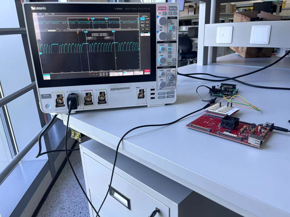
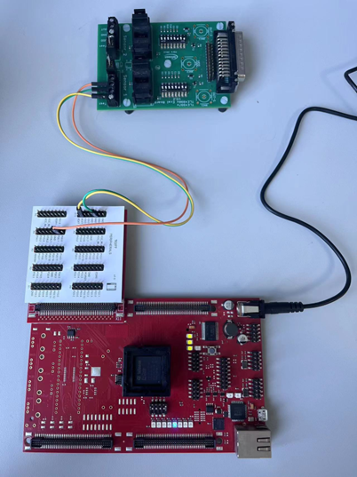
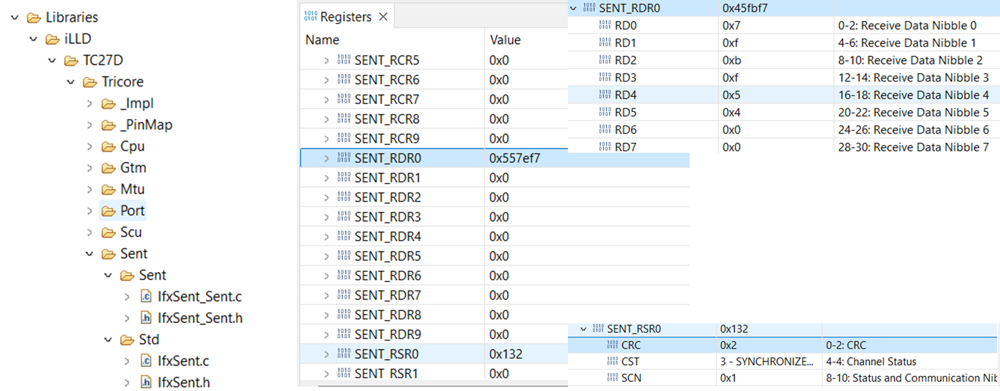

# Aurix: TLE4998S4 Linear Sensor interfacing with TC277 Aurix Controller

Single Edge Nibble Transmission ([SENT](https://www.infineon.com/dgdl/Infineon-AURIX_Single_Edge_Nibble_Transmission-TR-v01_00-EN.pdf?fileId=5546d46269bda8df0169ca92cce62596)) is a unidirectional communications scheme from sensor/transmitting device to controller/receiving device. The sensor signal is transmitted as a series of pulses with data encoded as falling to falling edge periods. This code example demonstrates how to interface linear sensor [TLE4998S4](https://www.infineon.com/cms/en/product/sensor/magnetic-sensors/magnetic-position-sensors/linear-sensors/tle4998s4) with [TC277](https://www.infineon.com/cms/en/product/microcontroller/32-bit-tricore-microcontroller/32-bit-tricore-aurix-tc2xx/aurix-family-tc27xt/sak-tc277tp-64f200n-dc) Aurix Controller. TC277 provides 10 SENT channels for connection to sensors, enabling decode the pulses transmited from TLE4998S4 and store result data in the corresponding registers.

## Requirements

- ADS (AURIX Development Studio)
- [Evaluation Boards KIT_AURIX_TC277_TRB](https://www.infineon.com/cms/en/product/evaluation-boards/kit_aurix_tc277_trb)
- [TLE4998S4](https://www.infineon.com/cms/en/product/sensor/magnetic-sensors/magnetic-position-sensors/linear-sensors/tle4998s4)

## Hardware setup

Figure 1 : Waveform of SENT signal

The sensor is interfaced with the controller via SENT interface.

| TriBoard TC277 | TLE4998S4 |
| -------------- | --------- |
| X702.VEXT      | VDD (5V)  |
| X702.GND       | GND       |
| X702.P00.1     | OUT       |

Table 1 : Hardware connection table

Figure 2 : Hardware setup TC277 evaluation board with TLE4998S4

## Software setup

This setup is implemented using the ADS platform for SENT communication.

Figure 3 : Decoded SENT frame data

**Step 1**: Install ADS.

**Step 2**: Import exsiting project into workspace.

**Step 3**: Set this project as active and debug with TASKING. 

**Step 4**: Set breakpoint at **RSI** interrupt handler which signifies the end of a frame has been successfullyreceived.

**Step 5**: Watch the corresponed register in accordance with the specified SENT format and verify its consistency with data source terminal.

## Related resources

| Resources                | Links                                                                                                                                                                                                                                                                                  |
|:------------------------ | -------------------------------------------------------------------------------------------------------------------------------------------------------------------------------------------------------------------------------------------------------------------------------------- |
| Sensor TLE4998S4         | [TLE4998S Datasheet](https://www.infineon.com/dgdl/Infineon-TLE4998S-DS-v01_00-en.pdf?fileId=db3a30431ce5fb52011d3ec7bd4c25bd)   [TLE4998 UserManual](https://www.infineon.com/dgdl/Infineon-TLE4998_Linear_Halls-UserManual-v01_04-EN.pdf?fileId=5546d4625d5945ed015d9e2d7787510a) |
| Controller TC277         | [TC277 Datasheet](https://www.infineon.com/dgdl/Infineon-TC27x_DS_Addendum-DataSheet-v01_20-EN.pdf?fileId=5546d4627883d7e00178b64a0d244053)                                                                                                                                            |
| TriBoardManual-TC2X7-V13 | MyICP                                                                                                                                                                                                                                                                                  |
| SENT Protocal Standard   | [SAE J2716_201604](https://www.sae.org/standards/content/j2716_201604/)                                                                                                                                                                                                                |
| SENT KBA                 | [Possible Combinations of Error Flags in SENT module](https://community.infineon.com/t5/Knowledge-Base-Articles/AURIX-MCU-Possible-combinations-of-error-flags-in-SENT-module-KBA239730/ta-p/744683)                                                                                   |
