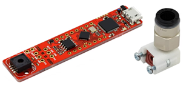
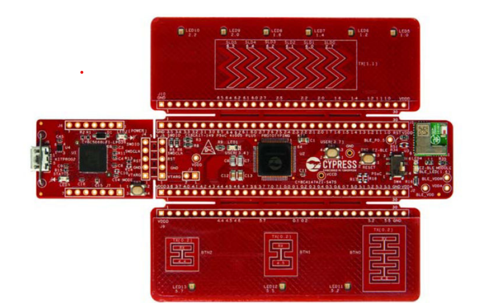
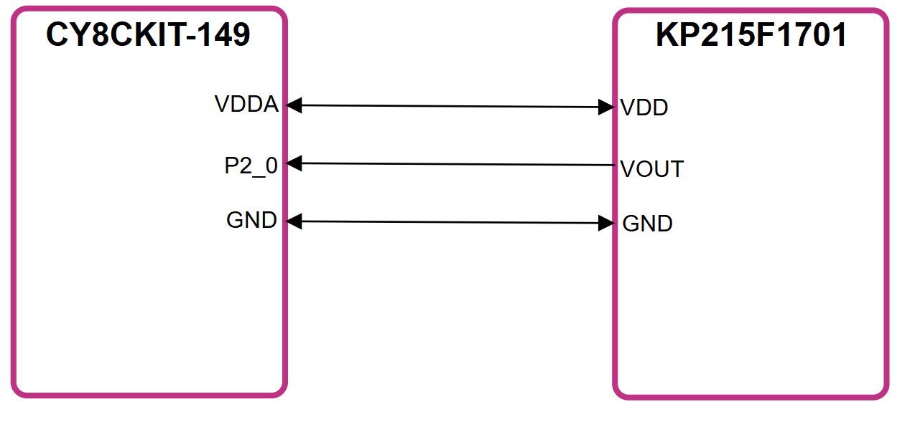
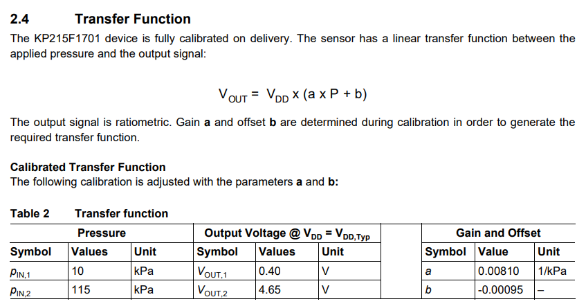
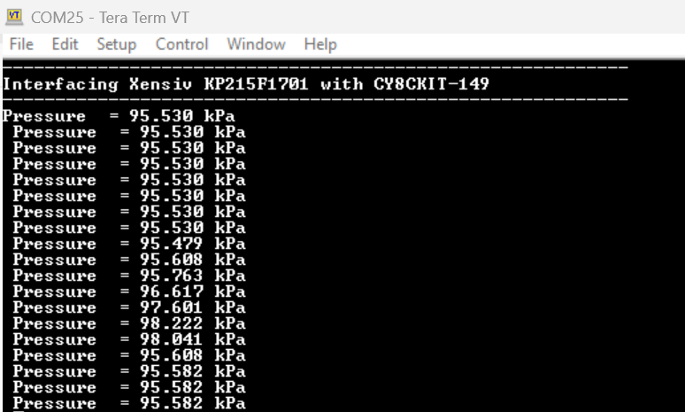

# PSOC&trade; 4 MCU: XENSIV&trade; KP215F1701  MAP pressure sensor readout

Disclaimer: This is a community code example (CCE) released for the benefit of the community users. These projects have only been tested for the listed BSPs, tools versions, and toolchains documented in this readme. They are intended to demonstrate how a solution / concept / use-case can be achieved on a particular device. For official code examples, please click here.

## Overview
This CCE allows you to interface the KP215F1701 analog pressure sensor with the PSoC™ 4 MCU (CY8CKIT‑149) through a SAR ADC peripheral and stream data to a serial terminal through a UART‑USB bridge.

## Requirements

- [ModusToolbox&trade;](https://www.infineon.com/modustoolbox) v3.5 or later (tested with v3.5)
- Board support package (BSP) minimum required version: 3.1.0
- Programming language: C
- Associated parts: [PSOC&trade; 4000S, PSOC&trade; 4100S, PSOC&trade; 4100S Plus, PSOC&trade; 4500S, PSOC&trade; 4100S Max, PSOC&trade; 4000T, PSOC&trade; 4100T Plus](https://www.infineon.com/cms/en/product/microcontroller/32-bit-psoc-arm-cortex-microcontroller/psoc-4-32-bit-arm-cortex-m0-mcu/) and [PSOC&trade; 4 HV (High Voltage)](https://www.infineon.com/cms/en/product/microcontroller/32-bit-psoc-arm-cortex-microcontroller/32-bit-psoc-4-hv-arm-cortex-m0/)
- [KP215F1701](https://www.infineon.com/part/KP215F1701) XENSIV&trade; MAP pressure sensor
## Supported toolchains (make variable 'TOOLCHAIN')

- GNU Arm&reg; Embedded Compiler v11.3.1 (`GCC_ARM`) – Default value of `TOOLCHAIN`
- Arm&reg; Compiler v6.22 (`ARM`)
- IAR C/C++ Compiler v9.50.2 (`IAR`)

## Supported kits (make variable 'TARGET')

- [PSOC&trade; 4100S Plus Prototyping Kit](https://www.infineon.com/CY8CKIT-149) (`CY8CKIT-149`)

## Features
The Infineon KP215F1701 is a high‑precision analog absolute pressure sensor designed for manifold air pressure measurement in automotive applications. It operates across a wide pressure range of 10 kPa to 115 kPa with an accuracy of ±1.4 kPa, making it suitable for demanding engine control systems.
This code example supports all XENSIV&trade; analog sensors. Note that the gain and offset used to convert the measured analog voltage to pressure are sensor-specific and must be taken from the transfer function section of the respective datasheet.

## Hardware setup

Use the jumper wires to establish a connection between KP215F1701 pressure sensor and PSoC4 4100Splus kit as shown in figure 1. 

> **Note:** Some of the PSOC&trade; 4 kits ship with KitProg2 installed. ModusToolbox&trade; requires KitProg3. Before using this code example, make sure that the board is upgraded to KitProg3. The tool and instructions are available in the [Firmware Loader](https://github.com/Infineon/Firmware-loader) GitHub repository. If you do not upgrade, you will see an error like "unable to find CMSIS-DAP device" or "KitProg firmware is out of date".



**Figure 1. KP215F1701 PS2GO-KIT**



**Figure 2. CY8CKIT-149**  



**Figure 3. Pin Connections**  

1. Connect **VDD** of sensor to **VDDA** of PSoC4 kit
2. Connect **VOUT** of sensor to **P2[0]** of PSoC4 kit.
3. Connect **GND** of sensor to **GND** of PSoC4 kit.

> **Note:** Please check the device configurator to understand ADC configurations.

## Software setup

See the [ModusToolbox&trade; tools package installation guide](https://www.infineon.com/ModusToolboxInstallguide) for information about installing and configuring the tools package.

Install a terminal emulator if you don't have one. Instructions in this document use [Tera Term](https://teratermproject.github.io/index-en.html).

This example requires no additional software or tools

## Calculations

The KP215F1701 is an analog pressure sensor whose output pin is interfaced to the 12‑bit SAR ADC of the CY8CKIT‑149 through pin P2_0. The ADC conversion process is initiated using the Cy_SAR_StartConvert() API, which triggers a single‑shot ADC scan. The firmware then polls the conversion status using the Cy_SAR_IsEndConversion() API and waits until the scan is successfully completed.

Once the conversion is complete, the 12‑bit digital sample is read from the ADC result register. The ADC output code ranges from 0 to 4095, corresponding to an input voltage range of 0–5 V. To reconstruct the analog‑equivalent voltage of the sensor output, the digital ADC value is divided by the full‑scale count (4095) and multiplied by the reference voltage VDDA (5 V). This computation yields the actual sensor output voltage corresponding to the measured pressure.

Subsequently, the ambient pressure is calculated using the transfer function specified in Section 2.4 of the KP215F1701 datasheet (refer to Figure 4). By applying the datasheet-defined equation to the reconstructed sensor voltage, the corresponding pressure value is accurately derived.



**Figure 4. Transfer Function of KP215F1701**

## Operation

1. Connect the board to your PC using the provided USB cable through the USB connector.
2. Open a terminal program and select the KitProg3 COM port. Set the serial port parameters to 8N1 and 115200 baud.
   <details><summary><b>Using Eclipse IDE</b></summary>

      1. Select the application project in the Project Explorer.

      2. In the **Quick Panel**, scroll down, and click **\<Application Name> Program (KitProg3_MiniProg4)**.
   </details>


   <details><summary><b>In other IDEs</b></summary>

   Follow the instructions in your preferred IDE.
   </details>


   <details><summary><b>Using CLI</b></summary>

     From the terminal, execute the `make program` command to build and program the application using the default toolchain to the default target. The default toolchain is specified in the application's Makefile but you can override this value manually:
      ```
      make program TOOLCHAIN=<toolchain>
      ```

      Example:
      ```
      make program TOOLCHAIN=GCC_ARM
      ```
   </details>

4. After programming, the application starts automatically. Confirm that "Interfacing Xensiv KP215F1701 with CY8CKIT-149" is displayed on the UART terminal as shown in figure 5.



**Figure 5. Tera term output**

## Debugging

You can debug the example to step through the code.

<details><summary><b>In Eclipse IDE</b></summary>

Use the **\<Application Name> Debug (KitProg3_MiniProg4)** configuration in the **Quick Panel**. For details, see the "Program and debug" section in the [Eclipse IDE for ModusToolbox&trade; user guide](https://www.infineon.com/MTBEclipseIDEUserGuide).

</details>

<details><summary><b>In other IDEs</b></summary>

Follow the instructions in your preferred IDE.
</details>
<br>

## Related resources

Resources  | Links
-----------|----------------------------------
Application notes  | [AN79953](https://www.infineon.com/AN79953) – Getting started with PSOC&trade; 4<br>[AN0034](https://www.infineon.com/row/public/documents/10/42/infineon-an0034-getting-started-with-psoc-4-hv-ms-mcus-in-modustoolbox-applicationnotes-en.pdf) - Getting started with PSOC&trade; 4 HV MS MCUs in ModusToolbox&trade;
Code examples  | [Using ModusToolbox&trade;](https://github.com/Infineon/Code-Examples-for-ModusToolbox-Software) on GitHub
Device documentation | [PSOC&trade; 4 datasheets](https://documentation.infineon.com/psoc4/docs/qqs1702048028479) <br>[PSOC&trade; 4 technical reference manuals](https://documentation.infineon.com/psoc4/docs/hup1702048028817) <br>[PSOC&trade; high voltage (HV) mixed signal (MS) automotive MCU 128K datasheets](https://www.infineon.com/assets/row/public/documents/10/49/infineon-cy8c41x7-psoc-4-high-voltage-hv-mixed-signal-ms-automotive-mcu-based-on-32-bit-arm-cortex--m0-datasheet-en.pdf) <br>[PSOC&trade; high voltage (HV) mixed signal (MS) automotive MCU 64K datasheets](https://www.infineon.com/assets/row/public/documents/10/49/infineon-cy8c41x5-cy8c41x6-psoc-4-high-voltage-hv-mixed-signal-ms-automotive-mcu-based-on-32-bit-arm-cortex--m0-datasheet-en-09018a9080d1ff70.pdf) <br>[PSOC&trade; high voltage (HV) precision analog (PA) automotive MCU 144K datasheets](https://documentation.infineon.com/psoc4atv/docs/rsd1669346756301) <br>[PSOC&trade; high voltage (HV) mixed signal (MS) MCU: PSOC&trade; HVMS-128K registers reference manuals](https://www.infineon.com/row/public/documents/10/57/infineon-psoc-high-voltagehvmixed-signal-msmcu-psoc-hvms-128k-registers-reference-manual-additionaltechnicalinformation-en.pdf) <br>[PSOC&trade; high voltage (HV) mixed signal (MS) MCU: PSOC&trade; HVMS-64K registers reference manuals](https://www.infineon.com/content/dam/infineon/row/public/documents/10/57/infineon-psoc-4-high-voltagehvmixed-signalmsmcu-psoc4hvms-64k-registers-reference-manual-additionaltechnicalinformation-en.pdf) <br>[PSOC&trade; high voltage (HV) mixed signal (MS) MCU architecture reference manuals](https://www.infineon.com/assets/row/public/documents/10/57/infineon-psoc-high-voltage-hv-mixed-signal-ms-mcu-architecture-reference-manual-additionaltechnicalinformation-en.pdf) <br>[PSOC&trade; high voltage (HV) precision analog (PA) MCU architecture reference manuals](https://documentation.infineon.com/psoc4atv/docs/vkg1670389100008)
Sensor kit | [KP215F1701](https://www.infineon.com/part/KP215F1701).
Libraries on GitHub | [mtb-pdl-cat2](https://github.com/Infineon/mtb-pdl-cat2) – PSOC&trade; 4 Peripheral Driver Library (PDL)<br> [mtb-hal-cat2](https://github.com/Infineon/mtb-hal-cat2) – Hardware Abstraction Layer (HAL) library
Tools  | [ModusToolbox&trade;](https://www.infineon.com/modustoolbox) – ModusToolbox&trade; software is a collection of easy-to-use libraries and tools enabling rapid development with Infineon MCUs for applications ranging from wireless and cloud-connected systems, edge AI/ML, embedded sense and control, to wired USB connectivity using PSOC&trade; Industrial/IoT MCUs, AIROC&trade; Wi-Fi and Bluetooth&reg; connectivity devices, XMC&trade; Industrial MCUs, and EZ-USB&trade;/EZ-PD&trade; wired connectivity controllers. ModusToolbox&trade; incorporates a comprehensive set of BSPs, HAL, libraries, configuration tools, and provides support for industry-standard IDEs to fast-track your embedded application development.

<br>

## Other resources

Infineon provides a wealth of data at [www.infineon.com](https://www.infineon.com) to help you select the right device, and quickly and effectively integrate it into your design.

## Document history

Document title: *XENSIV™ KP215F1701 MAP pressure sensor readout*

Version | Description of change
------- | ---------------------
 1.0.0   | New community code example
<br>
---------------------------------------------------------

© Cypress Semiconductor Corporation, 2020-2025. This document is the property of Cypress Semiconductor Corporation, an Infineon Technologies company, and its affiliates ("Cypress").  This document, including any software or firmware included or referenced in this document ("Software"), is owned by Cypress under the intellectual property laws and treaties of the United States and other countries worldwide.  Cypress reserves all rights under such laws and treaties and does not, except as specifically stated in this paragraph, grant any license under its patents, copyrights, trademarks, or other intellectual property rights.  If the Software is not accompanied by a license agreement and you do not otherwise have a written agreement with Cypress governing the use of the Software, then Cypress hereby grants you a personal, non-exclusive, nontransferable license (without the right to sublicense) (1) under its copyright rights in the Software (a) for Software provided in source code form, to modify and reproduce the Software solely for use with Cypress hardware products, only internally within your organization, and (b) to distribute the Software in binary code form externally to end users (either directly or indirectly through resellers and distributors), solely for use on Cypress hardware product units, and (2) under those claims of Cypress's patents that are infringed by the Software (as provided by Cypress, unmodified) to make, use, distribute, and import the Software solely for use with Cypress hardware products.  Any other use, reproduction, modification, translation, or compilation of the Software is prohibited.
<br>
TO THE EXTENT PERMITTED BY APPLICABLE LAW, CYPRESS MAKES NO WARRANTY OF ANY KIND, EXPRESS OR IMPLIED, WITH REGARD TO THIS DOCUMENT OR ANY SOFTWARE OR ACCOMPANYING HARDWARE, INCLUDING, BUT NOT LIMITED TO, THE IMPLIED WARRANTIES OF MERCHANTABILITY AND FITNESS FOR A PARTICULAR PURPOSE.  No computing device can be absolutely secure.  Therefore, despite security measures implemented in Cypress hardware or software products, Cypress shall have no liability arising out of any security breach, such as unauthorized access to or use of a Cypress product. CYPRESS DOES NOT REPRESENT, WARRANT, OR GUARANTEE THAT CYPRESS PRODUCTS, OR SYSTEMS CREATED USING CYPRESS PRODUCTS, WILL BE FREE FROM CORRUPTION, ATTACK, VIRUSES, INTERFERENCE, HACKING, DATA LOSS OR THEFT, OR OTHER SECURITY INTRUSION (collectively, "Security Breach").  Cypress disclaims any liability relating to any Security Breach, and you shall and hereby do release Cypress from any claim, damage, or other liability arising from any Security Breach.  In addition, the products described in these materials may contain design defects or errors known as errata which may cause the product to deviate from published specifications. To the extent permitted by applicable law, Cypress reserves the right to make changes to this document without further notice. Cypress does not assume any liability arising out of the application or use of any product or circuit described in this document. Any information provided in this document, including any sample design information or programming code, is provided only for reference purposes.  It is the responsibility of the user of this document to properly design, program, and test the functionality and safety of any application made of this information and any resulting product.  "High-Risk Device" means any device or system whose failure could cause personal injury, death, or property damage.  Examples of High-Risk Devices are weapons, nuclear installations, surgical implants, and other medical devices.  "Critical Component" means any component of a High-Risk Device whose failure to perform can be reasonably expected to cause, directly or indirectly, the failure of the High-Risk Device, or to affect its safety or effectiveness.  Cypress is not liable, in whole or in part, and you shall and hereby do release Cypress from any claim, damage, or other liability arising from any use of a Cypress product as a Critical Component in a High-Risk Device. You shall indemnify and hold Cypress, including its affiliates, and its directors, officers, employees, agents, distributors, and assigns harmless from and against all claims, costs, damages, and expenses, arising out of any claim, including claims for product liability, personal injury or death, or property damage arising from any use of a Cypress product as a Critical Component in a High-Risk Device. Cypress products are not intended or authorized for use as a Critical Component in any High-Risk Device except to the limited extent that (i) Cypress's published data sheet for the product explicitly states Cypress has qualified the product for use in a specific High-Risk Device, or (ii) Cypress has given you advance written authorization to use the product as a Critical Component in the specific High-Risk Device and you have signed a separate indemnification agreement.
<br>
Cypress, the Cypress logo, and combinations thereof, ModusToolbox, PSOC, CAPSENSE, EZ-USB, F-RAM, and TRAVEO are trademarks or registered trademarks of Cypress or a subsidiary of Cypress in the United States or in other countries. For a more complete list of Cypress trademarks, visit www.infineon.com. Other names and brands may be claimed as property of their respective owners.
