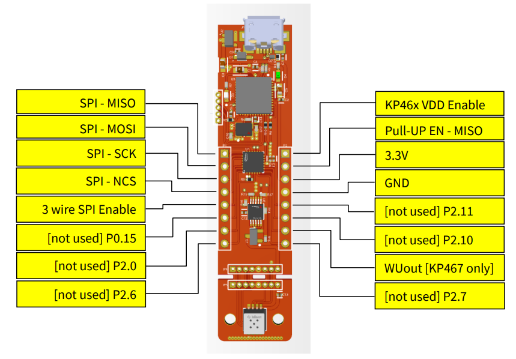
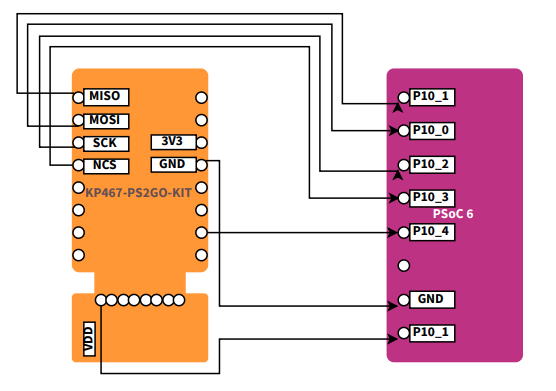
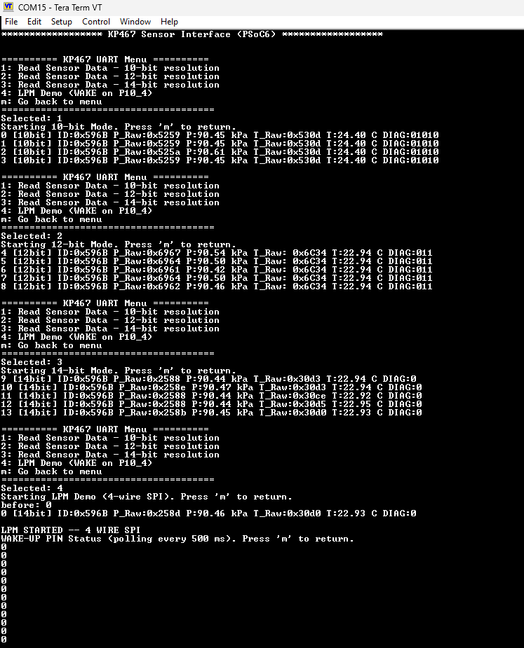

# KP467 on PSoC6 (SPI) - Readout + LPM Demo

## Overview


*Disclaimer: This is a community code example (CCE) released for the benefit of the community users. These projects have only been tested for the listed BSPs, tools versions, and toolchains documented in this readme. They are intended to demonstrate how a solution / concept / use-case can be achieved on a particular device. For official code examples, please click [here](https://github.com/Infineon/Code-Examples-for-ModusToolbox-Software).*

The project interfaces the Infineon [KP467](https://www.infineon.com/part/KP467) pressure sensor with a PSoC™ 6 MCU over 4-wire SPI. 
It provides a UART menu to read sensor data at 10-bit, 12-bit, or 14-bit resolution and a Low-Power Monitoring (LPM) demonstration that uses the senso's WAKE UP pin to notify the MCU of a pressure based wake event. 

This setup is implemented using the ModusToolBox Eclipse-based IDE and Tera Term for UART communication.

## Requirements

- [ModusToolbox&trade;](https://www.infineon.com/modustoolbox) v3.3 or later (tested with v3.2)
- Board support package (BSP) minimum required version: 4.0.0
- Programming language: C
- Associated parts: All [PSoC&trade; 6 MCU](https://www.infineon.com/cms/en/product/microcontroller/32-bit-psoc-arm-cortex-microcontroller/psoc-6-32-bit-arm-cortex-m4-mcu) parts
- [KP467](https://www.infineon.com/part/KP467) sensor board/module (Here I used KP467-PS2GO-KIT)

## Supported toolchains (make variable 'TOOLCHAIN')

- GNU Arm&reg; Embedded Compiler v11.3.1 (`GCC_ARM`) – Default value of `TOOLCHAIN`
- Arm&reg; Compiler v6.16 (`ARM`)
- IAR C/C++ Compiler v9.40.2 (`IAR`)


## Supported kits (make variable 'TARGET')

- [PSoC&trade; 6 Bluetooth&reg; LE Pioneer Kit](https://www.infineon.com/CY8CKIT-062-BLE) (`CY8CKIT-062-BLE`)

## Hardware setup

This example uses the board's default configuration. See the kit user guide to ensure that the board is configured correctly.

> **Note:** The PSoC&trade; 6 Bluetooth&reg; LE Pioneer Kit (CY8CKIT-062-BLE) and the PSoC&trade; 6 Wi-Fi Bluetooth&reg; Pioneer Kit (CY8CKIT-062-WIFI-BT) ship with KitProg2 installed. ModusToolbox&trade; requires KitProg3. Before using this code example, make sure that the board is upgraded to KitProg3. The tool and instructions are available in the [Firmware Loader](https://github.com/Infineon/Firmware-loader) GitHub repository. If you do not upgrade, you will see an error like "unable to find CMSIS-DAP device" or "KitProg firmware is out of date".

Use jumper wires to establish a connection between KP467 Pressure sensor and the the PSoC™ 6 Bluetooth® pioneer kit as mentioned below.


   **Figure 1. KP46x-PS2GO-KIT side connectors pin-out**

   

1. Connect **VDD** of the sensor to the **3.3V** supply on the PSoC6 kit.
2. Connect the **GND** pin of the sensor to the **GND** of the PSoC6 kit.
3. Connect the **WOUT** of the sensor to a GPIO pin on PSoC6 **P10[4]**, which is wakeup pin configured in the main.

Following pins are configured via device configurator in modus tool box via communication block SCB1.

General Confiuration: Clock mode configured as CPHA =1 and CPOL = 0 as per datsheet.
Data configuration : Bit order as MSB first and RX and TX data widthas 8 bits.

4. Connect the **MOSI** of the sensor to a GPIO pin on PSoC6 **P10[0]**.
5. Connect the **MISO** of the sensor to a GPIO pin on PSoC6 **P10[1]**.
6. Connect the **SCK** of the sensor to a GPIO pin on PSoC6 **P10[2]**.
7. Connect the **NCS** of the sensor to a GPIO pin on PSoC6 **P10[3]** with active low polarity.


NOTE: For my code I used the [KP467-PS2GO-KIT](https://www.infineon.com/evaluation-board/KP467-PS2GO-KIT) in which the 3V3 pin on XMC side is not routed to the sensor. So power the sensor directly on breakout board pinnamed "VDD".

   **Figure 2. Connection diagram**

   

## Software setup

See the [ModusToolbox&trade; tools package installation guide](https://www.infineon.com/ModusToolboxInstallguide) for information about installing and configuring the tools package.

Install a terminal emulator if you don't have one. Instructions in this document use [Tera Term](https://teratermproject.github.io/index-en.html).

This example requires no additional software or tools.

## Operation

If using a PSoC&trade; 64 "Secure" MCU kit (like CY8CKIT-064B0S2-4343W), the PSoC&trade; 64 device must be provisioned with keys and policies before being programmed. Follow the instructions in the ["Secure Boot" SDK user guide](https://www.infineon.com/dgdlac/Infineon-PSoC_64_Secure_MCU_Secure_Boot_SDK_User_Guide-Software-v07_00-EN.pdf?fileId=8ac78c8c7d0d8da4017d0f8c361a7666) to provision the device. If the kit is already provisioned, copy-paste the keys and policy folder to the application folder.

1. Connect the board to your PC using the provided USB cable through the KitProg3 USB connector.

2. Open a terminal program and select the KitProg3 COM port. Set the serial port parameters to 8N1 and 115200 baud.

3. Program the board using one of the following:

   <details><summary><b>Using Eclipse IDE</b></summary>

      1. Select the application project in the Project Explorer.

      2. In the **Quick Panel**, scroll down, and click **\<Application Name> Program (KitProg3_MiniProg4)**.
   </details>


   <details><summary><b>In other IDEs</b></summary>

   Follow the instructions in your preferred IDE.
   </details>


   <details><summary><b>Using CLI</b></summary>

     From the terminal, execute the `make program` command to build and program the application using the default toolchain to the default target. The default toolchain is specified in the application's Makefile but you can override this value manually:
      ```
      make program TOOLCHAIN=<toolchain>
      ```

      Example:
      ```
      make program TOOLCHAIN=GCC_ARM
      ```
   </details>

4. After programming, the application starts automatically. Confirm that "PSoC6: Tooth Wheel Speed Measurement" is displayed on the UART terminal.

   **Figure 1. Terminal output on program startup**

   

   

## Debugging

You can debug the example to step through the code.


<details><summary><b>In Eclipse IDE</b></summary>

Use the **\<Application Name> Debug (KitProg3_MiniProg4)** configuration in the **Quick Panel**. For details, see the "Program and debug" section in the [Eclipse IDE for ModusToolbox&trade; user guide](https://www.infineon.com/MTBEclipseIDEUserGuide).

<mark> Add the below Note for relevant CCEs only, like PSoC 6 MCU based. Remove this note for others.

> **Note:** **(Only while debugging)** On the CM4 CPU, some code in `main()` may execute before the debugger halts at the beginning of `main()`. This means that some code executes twice – once before the debugger stops execution, and again after the debugger resets the program counter to the beginning of `main()`. See [KBA231071](https://community.infineon.com/docs/DOC-21143) to learn about this and for the workaround.

</details>


<details><summary><b>In other IDEs</b></summary>

Follow the instructions in your preferred IDE.
</details>

## Design and implementation

1. Main function:
   - Initializes SCB1 SPI block on PSoC6 via device configurator. Initialize board, UART, SPI and GPIO. 
   - Enters main loop and executes user-selected mode.
   - continuously prints sensor data or LPM diagnostics to serial console

2. Sensor readout
   - Sends SPI commands -> receives raw data -> parity check -> extract DIAG -> convert kPa and ℃ -> print to console.

3. LPM
   - Start LPM with SPI command.
   - Poll WAKE pin every 500 ms.
   - On wake event -> read LPM status + pressure history (N, N-1, N-2) -> calculate deltas -> print diagnostics.

## Related resources

Resources  | Links
-----------|----------------------------------
Application notes  | [AN228571](https://www.infineon.com/AN228571) – Getting started with PSoC&trade; 6 MCU on ModusToolbox&trade; <br>  [AN215656](https://www.infineon.com/AN215656) – PSoC&trade; 6 MCU: Dual-CPU system design <br> [AN79953](https://www.infineon.com/AN79953) – Getting started with PSoC&trade; 4 <br>  [AN85951](https://www.infineon.com/AN85951) – PSoC&trade; 4 and PSoC&trade; 6 MCU CAPSENSE&trade; design guide
Code examples  | [Using ModusToolbox&trade;](https://github.com/Infineon/Code-Examples-for-ModusToolbox-Software) on GitHub
Device documentation | [PSoC&trade; 6 MCU datasheets](https://documentation.infineon.com/html/psoc6/bnm1651211483724.html) <br> [PSoC&trade; 6 technical reference manuals](https://documentation.infineon.com/html/psoc6/zrs1651212645947.html)<br> [PSoC&trade; 4 datasheets](https://www.infineon.com/cms/en/search.html?intc=searchkwr-return#!view=downloads&term=psoc%204&doc_group=Data%20Sheet) <br>[PSoC&trade; 4 technical reference manuals](https://www.infineon.com/cms/en/search.html#!term=psoc%204%20technical%20reference%20manual&view=all)
Development kits | Select your kits from the [Evaluation board finder](https://www.infineon.com/cms/en/design-support/finder-selection-tools/product-finder/evaluation-board).
Libraries on GitHub  | [mtb-pdl-cat1](https://github.com/Infineon/mtb-pdl-cat1) – PSoC&trade; 6 Peripheral Driver Library (PDL)  <br> [mtb-hal-cat1](https://github.com/Infineon/mtb-hal-cat1) – Hardware Abstraction Layer (HAL) library <br> [retarget-io](https://github.com/Infineon/retarget-io) – Utility library to retarget STDIO messages to a UART port <br>  [mtb-pdl-cat2](https://github.com/Infineon/mtb-pdl-cat2) – PSoC&trade; 4 Peripheral Driver Library (PDL) <br>  [mtb-hal-cat2](https://github.com/Infineon/mtb-hal-cat2) – Hardware Abstraction Layer (HAL) library
Middleware on GitHub  | [capsense](https://github.com/Infineon/capsense) – CAPSENSE&trade; library and documents <br> [psoc6-middleware](https://github.com/Infineon/modustoolbox-software#psoc-6-middleware-libraries) – Links to all PSoC&trade; 6 MCU middleware
Tools  | [ModusToolbox&trade;](https://www.infineon.com/modustoolbox) – ModusToolbox&trade; software is a collection of easy-to-use libraries and tools enabling rapid development with Infineon MCUs for applications ranging from wireless and cloud-connected systems, edge AI/ML, embedded sense and control, to wired USB connectivity using PSoC&trade; Industrial/IoT MCUs, AIROC&trade; Wi-Fi and Bluetooth&reg; connectivity devices, XMC&trade; Industrial MCUs, and EZ-USB&trade;/EZ-PD&trade; wired connectivity controllers. ModusToolbox&trade; incorporates a comprehensive set of BSPs, HAL, libraries, configuration tools, and provides support for industry-standard IDEs to fast-track your embedded application development.

<br>


## Other resources

Infineon provides a wealth of data at [www.infineon.com](https://www.infineon.com) to help you select the right device, and quickly and effectively integrate it into your design.


## Document history

Document title: *CCEnnnnn* – *Title of this document*

 Version | Description of change
 ------- | ---------------------
 1.0.0   | New community code example


All referenced product or service names and trademarks are the property of their respective owners.

The Bluetooth&reg; word mark and logos are registered trademarks owned by Bluetooth SIG, Inc., and any use of such marks by Infineon is under license.


